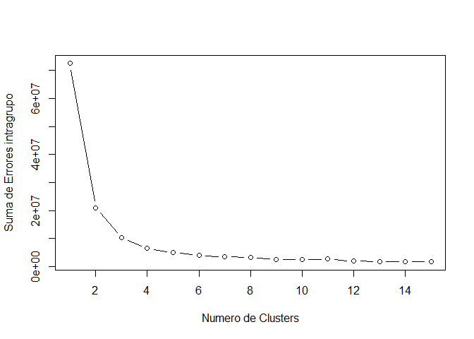
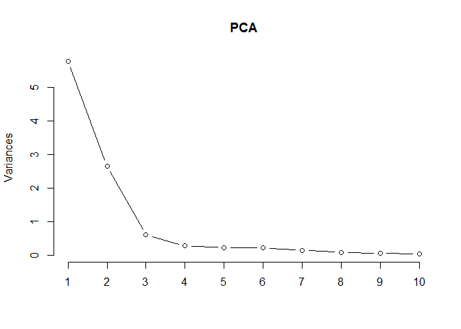
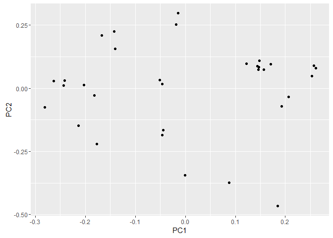
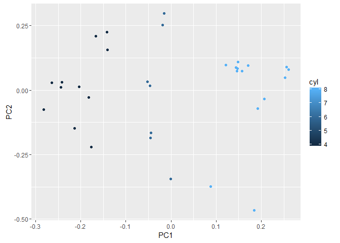
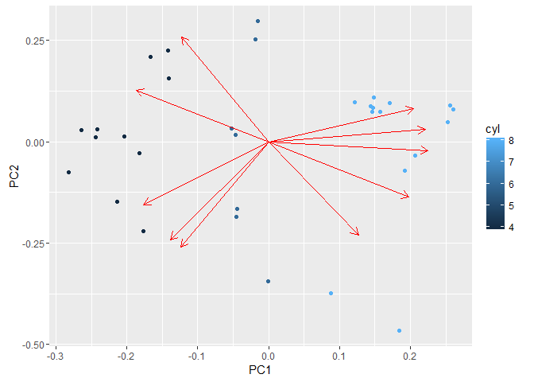
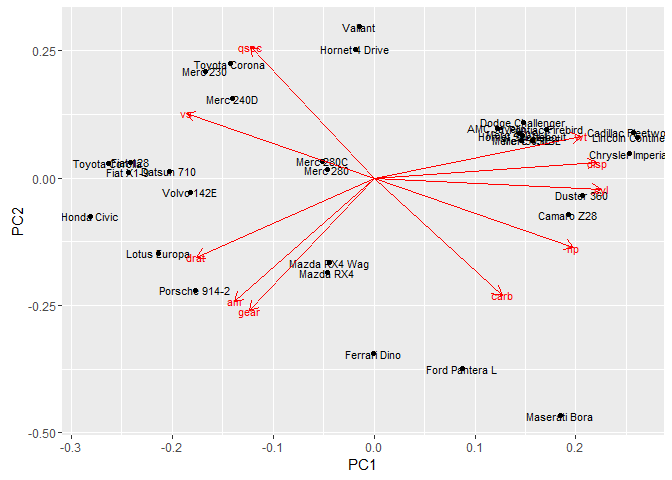
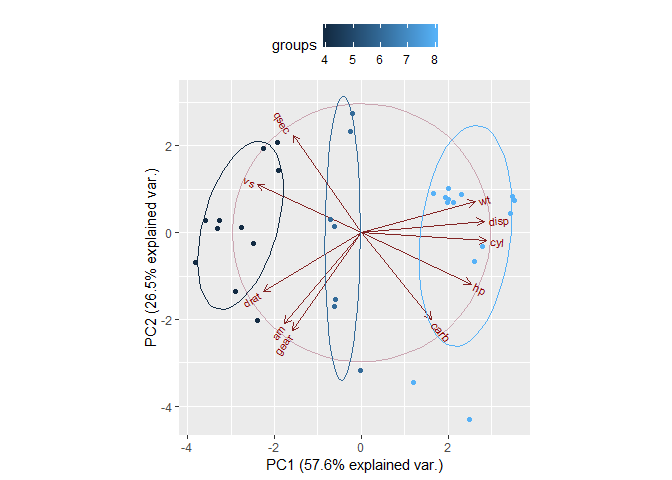
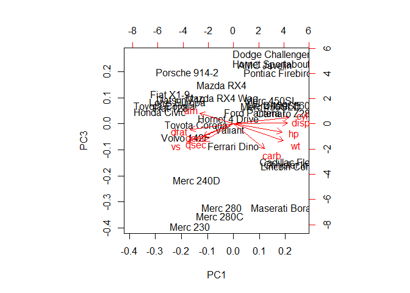
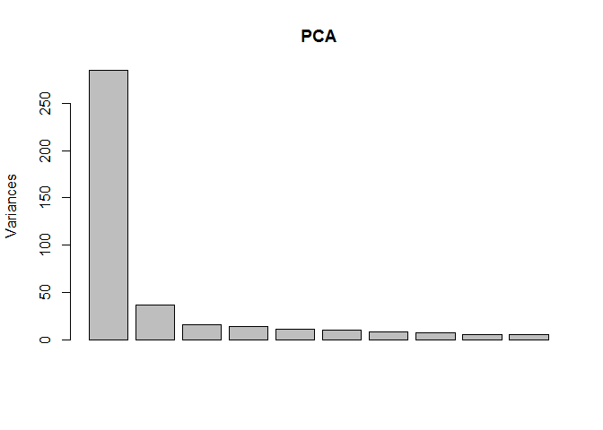

APRENDIZAJE NO SUPERVISADO
--------------------------

En aprendizaje supervisado, tenemos un output, conozco lo que quiero
estimar. Puede pasar que no tenga claro que es lo que quiero estimar y
quiero encontrar patrones dentro de esa información.

-   Clustering:

Coge todos los registros e intenta agruparlos por similitud. El
algoritmo intente buscar gente que se parezca, según la información que
tenga.

-   Clustering jerarquico:

El mas sencillo, vamos a hacer agrupamiento, tenemos todos los
registros, agrupamos en función de los que estén más proximos, puede
tener 20, 40 metodos... Tengo los puntos, defino la distancia entre
ellos. Según la distancia que elija me saldrá una distancia u otra, lo
importante es saber cual es el problema de negocio. Voy juntando de dos
en dos, una vez que tengo las parejas trazo las distancias entre
conjuntos (enlace simple es el modo más sencillo de calcular las
distancias, la más pequeña). Aglomerativa- enlace simple. Si repetimos
el mismo ejercicio siempre da el mismo resultado. Al final siempre
acabamos con todo metido dentro del mismo conglomerado. El
**dendograma** es la representación del agrupamiento, abajo distancia
pequeña, arriba distancia más alta. arriba del todo tengo que elegir una
altura donde cortar, dependiendo donde corte quedaran un numero de
grupos. que sean suficiente numero de grupos que seas capaces de
gestionar para encontrar un patrón de negocio.(grupos de tengan
caracteristicas que puedas gestionar).

*Ventajas*: siempre sale igual lo haga yo u otra persona. *Desventajas*:
elegir el corte, la explotación del modelo, como asigno a una persona
nueva a un cluster?? no se puede hacer facilmente. Lanzar de nuevo puede
cambiar toda la estructura. Para hacer algo que perdure en el tiempo
bien, si hay que meter nuevas obs., esto no vale. Hay variables que no
van a cambiar, si te fijas en variables como el saldo, varian en el
tiempo, esto no valdrá.

-   Cluster particionado k-means:

Se calculan centroides con la media aritmética. tenemos que definir a
priori cuantos segmentos tengo que hacer o hago antes un jerárquico para
ver si hay bolsas... Tengo unos puntos, elijo por ejemplo 2 puntos
aleatorios, el resultado depende de la aleatoriedad, primero hay que
establecer semilla para que salga algo estable y reproducible (set.seed)
se fuerza al ordenador a que tenga un orden secuencial. Pongo el número
que quiera en set.seed(1234) luego pongo el mismo y me mantiene el
aleatorio.

Tengo dos puntos aleatorios, utilizo la distancia más próxima, me une
todos los puntos a estos dos puntos. El algoritmo iterativo intenta
afinarse, traslada el punto al centro de masas para optimizar la
distancia, ahora vuelve a asignar los puntos mas cercanos. El punto se
vuelve a desplazar y así hasta que se estabiliza y ya no rota, los
grupos que han quedado son los segmentos. El óptimo puede ser local, si
estableciese otra semilla probablemente el resultado sería otro,
distintos segmentos. Si me separa en segmentos que no tienen sentidos,
vuelvo a lanzarlo o cambio el número de segmentos. Si un punto está muy
lejos el centro lo va a mover.

k-means al final te quedas los centroides, si viene un punto nuevo es
más fácil cambiar la distancia, si cambian las variables de los
clientes, los segmentos pueden cambiar. Los clientes se irán moviendo, a
lo mejor me interesa volver a hacer el cluster.

¿cuantos cluster elegimos? vamos a ir lanzando 1,2,3,4,5 y veremos lo
que tiene sentido de negocio. Eso hay que ser capaz de explicarlo. Si en
esos vectores tengo edad 42, 213 y 88,5000, la distancia es 46 y 213,
hay que normalizar porque sino clasifica en función a la variable que
tenga una representación de variables más grande. Aquí solo se usan
variables numéricas.

La forma estándar de normalizar:

(variable - media) / desviacion típica

El problema es si hay alguien con muchos millones.

Técnica robusta:

Cambias media por la mediana, desviación típica por la desviación modal.
Después tienes regresiones robustas que evitan que los outlayers te
afecten.

Modo de representar el vector que tiene varias variables ----- reducción
de dimensionalidad, quiero reducir 40 variables en 3 y no quiero perder
info pierdo interpretabilidad. La mayoría de las veces se hacen por
problemas técnicos. Se utilizan mucho en machine learning. Para hacer
representaciones gráficas es muy útil.

Componentes principales (reducción dimensionalidad):

-   La matriz de covarianzas: a las varianzas le afecta la escala de
    las unidades.
-   Matriz de correlaciones: se utiliza porque es la normalizada.
    Siempre está entre -1 y 1. Los valores propios son todos positivos y
    suman 1,los puedo ordenar, me da la variabilidad, si me quedo con
    las primeras filas de cada matriz me va a dar muy parecido porque
    cojo los valores más altos, casi suman 1. En lugar de 40 dimensiones
    me quedan 4. Las variables que elegimos son ortogonales
    (independientes entre si).

-   Mayores aplicaciones\*: compresión de ficheros, conforme los
    primeros valores son más altos (mayor variabilidad posible), mejor
    es la reducción de dimensión.

HAY QUE PLANTEAR LAS HIPOTESIS PRIMERO Y DEPUÉS COMPROBAR CON OTRO
CONJUNTO FRAMINGHAM ---- DATOS SOBRE COLESTEROL

En los contrastes de hipotesis tu fijas el nivel de confianza

Librerias
---------

    library(dummies)

    ## dummies-1.5.6 provided by Decision Patterns

CLUSTERING JERARQUICO: NETFLIX MOVIES
=====================================

Carga de Datos
--------------

    movies = read.table("D:/master/data/Regresiones/movies.txt",header=TRUE, sep="|",quote="\"")

clasifica las peliculas en funcion del género Accion 0 o 1 si es de
acción la pelicula, una pelicula puede tener varias agrupaciones

Análisis Dataset
----------------

    str(movies)

    ## 'data.frame':    1664 obs. of  20 variables:
    ##  $ Title      : Factor w/ 1664 levels "'Til There Was You (1997)",..: 1525 618 555 594 344 1318 1545 111 391 1240 ...
    ##  $ Unknown    : int  0 0 0 0 0 0 0 0 0 0 ...
    ##  $ Action     : int  0 1 0 1 0 0 0 0 0 0 ...
    ##  $ Adventure  : int  0 1 0 0 0 0 0 0 0 0 ...
    ##  $ Animation  : int  1 0 0 0 0 0 0 0 0 0 ...
    ##  $ Childrens  : int  1 0 0 0 0 0 0 1 0 0 ...
    ##  $ Comedy     : int  1 0 0 1 0 0 0 1 0 0 ...
    ##  $ Crime      : int  0 0 0 0 1 0 0 0 0 0 ...
    ##  $ Documentary: int  0 0 0 0 0 0 0 0 0 0 ...
    ##  $ Drama      : int  0 0 0 1 1 1 1 1 1 1 ...
    ##  $ Fantasy    : int  0 0 0 0 0 0 0 0 0 0 ...
    ##  $ FilmNoir   : int  0 0 0 0 0 0 0 0 0 0 ...
    ##  $ Horror     : int  0 0 0 0 0 0 0 0 0 0 ...
    ##  $ Musical    : int  0 0 0 0 0 0 0 0 0 0 ...
    ##  $ Mystery    : int  0 0 0 0 0 0 0 0 0 0 ...
    ##  $ Romance    : int  0 0 0 0 0 0 0 0 0 0 ...
    ##  $ SciFi      : int  0 0 0 0 0 0 1 0 0 0 ...
    ##  $ Thriller   : int  0 1 1 0 1 0 0 0 0 0 ...
    ##  $ War        : int  0 0 0 0 0 0 0 0 0 1 ...
    ##  $ Western    : int  0 0 0 0 0 0 0 0 0 0 ...

    head(movies)

    ##                                                  Title Unknown Action
    ## 1                                     Toy Story (1995)       0      0
    ## 2                                     GoldenEye (1995)       0      1
    ## 3                                    Four Rooms (1995)       0      0
    ## 4                                    Get Shorty (1995)       0      1
    ## 5                                       Copycat (1995)       0      0
    ## 6 Shanghai Triad (Yao a yao yao dao waipo qiao) (1995)       0      0
    ##   Adventure Animation Childrens Comedy Crime Documentary Drama Fantasy
    ## 1         0         1         1      1     0           0     0       0
    ## 2         1         0         0      0     0           0     0       0
    ## 3         0         0         0      0     0           0     0       0
    ## 4         0         0         0      1     0           0     1       0
    ## 5         0         0         0      0     1           0     1       0
    ## 6         0         0         0      0     0           0     1       0
    ##   FilmNoir Horror Musical Mystery Romance SciFi Thriller War Western
    ## 1        0      0       0       0       0     0        0   0       0
    ## 2        0      0       0       0       0     0        1   0       0
    ## 3        0      0       0       0       0     0        1   0       0
    ## 4        0      0       0       0       0     0        0   0       0
    ## 5        0      0       0       0       0     0        1   0       0
    ## 6        0      0       0       0       0     0        0   0       0

    tail(movies)

    ##                                          Title Unknown Action Adventure
    ## 1659                   War at Home, The (1996)       0      0         0
    ## 1660                      Sweet Nothing (1995)       0      0         0
    ## 1661                         Mat' i syn (1997)       0      0         0
    ## 1662                          B. Monkey (1998)       0      0         0
    ## 1663                       You So Crazy (1994)       0      0         0
    ## 1664 Scream of Stone (Schrei aus Stein) (1991)       0      0         0
    ##      Animation Childrens Comedy Crime Documentary Drama Fantasy FilmNoir
    ## 1659         0         0      0     0           0     1       0        0
    ## 1660         0         0      0     0           0     1       0        0
    ## 1661         0         0      0     0           0     1       0        0
    ## 1662         0         0      0     0           0     0       0        0
    ## 1663         0         0      1     0           0     0       0        0
    ## 1664         0         0      0     0           0     1       0        0
    ##      Horror Musical Mystery Romance SciFi Thriller War Western
    ## 1659      0       0       0       0     0        0   0       0
    ## 1660      0       0       0       0     0        0   0       0
    ## 1661      0       0       0       0     0        0   0       0
    ## 1662      0       0       0       1     0        1   0       0
    ## 1663      0       0       0       0     0        0   0       0
    ## 1664      0       0       0       0     0        0   0       0

    table(movies$Comedy)

    ## 
    ##    0    1 
    ## 1162  502

    table(movies$Western)

    ## 
    ##    0    1 
    ## 1637   27

    table(movies$Romance, movies$Drama)

    ##    
    ##       0   1
    ##   0 801 619
    ##   1 147  97

Cruzamos romances y drama, hay 97 que son romances y drama a la vez. Si
tienes nulos les puedes dar un valor extremo, lo normal es quitarlo,
relleno con medios, medianos o KNN, o los que dan problema Los voy a
clasificar de forma distinta, en un grupo a parte. En la medida de lo
posible que no haya datos nulos.

Cálculo de distancias
---------------------

No normalizamos porque es 1 y 0, podría normalizar si quiero darle el
mismo peso a todas las categorias. Si pondero aquellas que tienen más
peliculas. Aquí no tengo el mismo numero de comedias, ni de
romanticas.... el peso no es el mismo.

### Cálculo las distancias en las columnas de la 2 a la 20

In mathematics, the Euclidean distance or Euclidean metric is the
"ordinary" (i.e. straight-line) distance between two points in Euclidean
space

In general, for an n-dimensional space, the distance is

d(p,q)={sqrt {(p1-q1)2+(p2-q2)2+....+(pi-qi)^2+....
+(pn-qn)^2}

Squared Euclidean distance

The standard Euclidean distance can be squared in order to place
progressively greater weight on objects that are farther apart. In this
case, the equation becomes

d2(p,q)=(p1-q1)2+(p2-q2)2+....+(pi-qi)2+....
+(pn-qn)^2

    distances = dist(movies[2:20], method = "euclidean")
    dim(movies)

    ## [1] 1664   20

Clustering Jerárquico
---------------------

    clusterMovies = hclust(distances, method = "ward.D")#cluster jerárquico, hclust es solo jerárquico
    clusterMovies#1664 objects

    ## 
    ## Call:
    ## hclust(d = distances, method = "ward.D")
    ## 
    ## Cluster method   : ward.D 
    ## Distance         : euclidean 
    ## Number of objects: 1664

    dev.off()

    ## null device 
    ##           1

    plot(clusterMovies) # es el Dendrogram,aqui ayuda poco porque hay muchos registros 1664

    rect.hclust(clusterMovies, k=2, border="yellow")
    rect.hclust(clusterMovies, k=3, border="blue")
    rect.hclust(clusterMovies, k=4, border="green")

    NumCluster=10

    rect.hclust(clusterMovies, k=NumCluster, border="red")#recta en los 10 clusters

    movies$clusterGroups = cutree(clusterMovies, k = NumCluster)# en la nueva columna te dice a que cluster pertenece
    #cada registro
    head(movies)

    ##                                                  Title Unknown Action
    ## 1                                     Toy Story (1995)       0      0
    ## 2                                     GoldenEye (1995)       0      1
    ## 3                                    Four Rooms (1995)       0      0
    ## 4                                    Get Shorty (1995)       0      1
    ## 5                                       Copycat (1995)       0      0
    ## 6 Shanghai Triad (Yao a yao yao dao waipo qiao) (1995)       0      0
    ##   Adventure Animation Childrens Comedy Crime Documentary Drama Fantasy
    ## 1         0         1         1      1     0           0     0       0
    ## 2         1         0         0      0     0           0     0       0
    ## 3         0         0         0      0     0           0     0       0
    ## 4         0         0         0      1     0           0     1       0
    ## 5         0         0         0      0     1           0     1       0
    ## 6         0         0         0      0     0           0     1       0
    ##   FilmNoir Horror Musical Mystery Romance SciFi Thriller War Western
    ## 1        0      0       0       0       0     0        0   0       0
    ## 2        0      0       0       0       0     0        1   0       0
    ## 3        0      0       0       0       0     0        1   0       0
    ## 4        0      0       0       0       0     0        0   0       0
    ## 5        0      0       0       0       0     0        1   0       0
    ## 6        0      0       0       0       0     0        0   0       0
    ##   clusterGroups
    ## 1             1
    ## 2             2
    ## 3             3
    ## 4             1
    ## 5             3
    ## 6             4

Análisis de Clusters
--------------------

Los clusters no tiene el mismo número de registros

    table(movies$clusterGroups) # cuantos registro hay en cada cluster

    ## 
    ##   1   2   3   4   5   6   7   8   9  10 
    ## 297 199 218 370 209 128  68  47  65  63

    tapply(movies$Action, movies$clusterGroups, mean)# las peliculas de accion en que cluster estan, en el cluster 2 #el 78% las peliculas son de accion

    ##         1         2         3         4         5         6         7 
    ## 0.1784512 0.7839196 0.1238532 0.0000000 0.0000000 0.1015625 0.0000000 
    ##         8         9        10 
    ## 0.0000000 0.0000000 0.0000000

    tapply(movies$Adventure, movies$clusterGroups, mean)

    ##          1          2          3          4          5          6 
    ## 0.18518519 0.35175879 0.03669725 0.00000000 0.00000000 0.00000000 
    ##          7          8          9         10 
    ## 0.00000000 0.00000000 0.00000000 0.00000000

    tapply(movies$Animation, movies$clusterGroups, mean)

    ##          1          2          3          4          5          6 
    ## 0.13468013 0.01005025 0.00000000 0.00000000 0.00000000 0.00000000 
    ##          7          8          9         10 
    ## 0.00000000 0.00000000 0.00000000 0.00000000

    tapply(movies$Childrens, movies$clusterGroups, mean)

    ##           1           2           3           4           5           6 
    ## 0.393939394 0.005025126 0.009174312 0.000000000 0.000000000 0.000000000 
    ##           7           8           9          10 
    ## 0.000000000 0.000000000 0.000000000 0.000000000

    tapply(movies$Comedy, movies$clusterGroups, mean)#el 5 el 7 y el 9 son comedias

    ##          1          2          3          4          5          6 
    ## 0.36363636 0.06532663 0.06422018 0.00000000 1.00000000 0.10937500 
    ##          7          8          9         10 
    ## 1.00000000 0.02127660 1.00000000 0.15873016

    tapply(movies$Crime, movies$clusterGroups, mean)#en el 3 es crimen esta relacionada con accion

    ##           1           2           3           4           5           6 
    ## 0.033670034 0.005025126 0.412844037 0.000000000 0.000000000 0.046875000 
    ##           7           8           9          10 
    ## 0.000000000 0.000000000 0.000000000 0.000000000

    tapply(movies$Documentary, movies$clusterGroups, mean)# el 8 son documentales

    ##          1          2          3          4          5          6 
    ## 0.01010101 0.00000000 0.00000000 0.00000000 0.00000000 0.00000000 
    ##          7          8          9         10 
    ## 0.00000000 1.00000000 0.00000000 0.00000000

    tapply(movies$Drama, movies$clusterGroups, mean)#4 drama, 6 drama

    ##         1         2         3         4         5         6         7 
    ## 0.3063973 0.1105528 0.3807339 1.0000000 0.0000000 0.6640625 0.0000000 
    ##         8         9        10 
    ## 0.0000000 1.0000000 0.0000000

    aggregate(.~clusterGroups,FUN=mean, data=movies)

    ##    clusterGroups    Title     Unknown    Action  Adventure  Animation
    ## 1              1 804.1717 0.006734007 0.1784512 0.18518519 0.13468013
    ## 2              2 830.5025 0.000000000 0.7839196 0.35175879 0.01005025
    ## 3              3 803.4450 0.000000000 0.1238532 0.03669725 0.00000000
    ## 4              4 861.6838 0.000000000 0.0000000 0.00000000 0.00000000
    ## 5              5 782.7847 0.000000000 0.0000000 0.00000000 0.00000000
    ## 6              6 886.3984 0.000000000 0.1015625 0.00000000 0.00000000
    ## 7              7 991.1471 0.000000000 0.0000000 0.00000000 0.00000000
    ## 8              8 816.4894 0.000000000 0.0000000 0.00000000 0.00000000
    ## 9              9 940.6923 0.000000000 0.0000000 0.00000000 0.00000000
    ## 10            10 686.0000 0.000000000 0.0000000 0.00000000 0.00000000
    ##      Childrens     Comedy       Crime Documentary     Drama     Fantasy
    ## 1  0.393939394 0.36363636 0.033670034  0.01010101 0.3063973 0.070707071
    ## 2  0.005025126 0.06532663 0.005025126  0.00000000 0.1105528 0.000000000
    ## 3  0.009174312 0.06422018 0.412844037  0.00000000 0.3807339 0.004587156
    ## 4  0.000000000 0.00000000 0.000000000  0.00000000 1.0000000 0.000000000
    ## 5  0.000000000 1.00000000 0.000000000  0.00000000 0.0000000 0.000000000
    ## 6  0.000000000 0.10937500 0.046875000  0.00000000 0.6640625 0.000000000
    ## 7  0.000000000 1.00000000 0.000000000  0.00000000 0.0000000 0.000000000
    ## 8  0.000000000 0.02127660 0.000000000  1.00000000 0.0000000 0.000000000
    ## 9  0.000000000 1.00000000 0.000000000  0.00000000 1.0000000 0.000000000
    ## 10 0.000000000 0.15873016 0.000000000  0.00000000 0.0000000 0.000000000
    ##     FilmNoir     Horror   Musical   Mystery    Romance      SciFi
    ## 1  0.0000000 0.01683502 0.1885522 0.0000000 0.10437710 0.07407407
    ## 2  0.0000000 0.08040201 0.0000000 0.0000000 0.04522613 0.34673367
    ## 3  0.1055046 0.01834862 0.0000000 0.2752294 0.03669725 0.04128440
    ## 4  0.0000000 0.00000000 0.0000000 0.0000000 0.00000000 0.00000000
    ## 5  0.0000000 0.00000000 0.0000000 0.0000000 0.00000000 0.00000000
    ## 6  0.0078125 0.01562500 0.0000000 0.0000000 1.00000000 0.00000000
    ## 7  0.0000000 0.00000000 0.0000000 0.0000000 1.00000000 0.00000000
    ## 8  0.0000000 0.00000000 0.0000000 0.0000000 0.00000000 0.00000000
    ## 9  0.0000000 0.00000000 0.0000000 0.0000000 0.00000000 0.00000000
    ## 10 0.0000000 1.00000000 0.0000000 0.0000000 0.00000000 0.00000000
    ##      Thriller        War    Western
    ## 1  0.04040404 0.22558923 0.09090909
    ## 2  0.37688442 0.01507538 0.00000000
    ## 3  0.61009174 0.00000000 0.00000000
    ## 4  0.00000000 0.00000000 0.00000000
    ## 5  0.00000000 0.00000000 0.00000000
    ## 6  0.14062500 0.00000000 0.00000000
    ## 7  0.00000000 0.00000000 0.00000000
    ## 8  0.00000000 0.02127660 0.00000000
    ## 9  0.00000000 0.00000000 0.00000000
    ## 10 0.15873016 0.00000000 0.00000000

Agregado, se puede usar para recomendar, esto permite definir las
categorias. Drama-romantico, drama-comedia. Estos datos son de Netflix

Búsqueda Películas
------------------

    subset(movies, Title=="Men in Black (1997)")# sale en el 2,accion, aventura....

    ##                   Title Unknown Action Adventure Animation Childrens
    ## 257 Men in Black (1997)       0      1         1         0         0
    ##     Comedy Crime Documentary Drama Fantasy FilmNoir Horror Musical Mystery
    ## 257      1     0           0     0       0        0      0       0       0
    ##     Romance SciFi Thriller War Western clusterGroups
    ## 257       0     1        0   0       0             2

    cluster2 = subset(movies, movies$clusterGroups==2) #peliculas con cluster 2
    cluster7 = subset(movies, movies$clusterGroups==7)
    cluster2$Title[1:10]#titulos cluster 2

    ##  [1] GoldenEye (1995)                              
    ##  [2] Bad Boys (1995)                               
    ##  [3] Apollo 13 (1995)                              
    ##  [4] Net, The (1995)                               
    ##  [5] Natural Born Killers (1994)                   
    ##  [6] Outbreak (1995)                               
    ##  [7] Stargate (1994)                               
    ##  [8] Fugitive, The (1993)                          
    ##  [9] Jurassic Park (1993)                          
    ## [10] Robert A. Heinlein's The Puppet Masters (1994)
    ## 1664 Levels: 'Til There Was You (1997) ... Zeus and Roxanne (1997)

    cluster7$Title[1:10]

    ##  [1] French Twist (Gazon maudit) (1995) 
    ##  [2] I.Q. (1994)                        
    ##  [3] While You Were Sleeping (1995)     
    ##  [4] Four Weddings and a Funeral (1994) 
    ##  [5] Hudsucker Proxy, The (1994)        
    ##  [6] Much Ado About Nothing (1993)      
    ##  [7] Sleepless in Seattle (1993)        
    ##  [8] Truth About Cats & Dogs, The (1996)
    ##  [9] Groundhog Day (1993)               
    ## [10] When Harry Met Sally... (1989)     
    ## 1664 Levels: 'Til There Was You (1997) ... Zeus and Roxanne (1997)

Clustering K-means
==================

Carga de datos
--------------

    creditos <- read.csv("D:/master/data/Regresiones/creditos.csv",stringsAsFactors = FALSE)

Revisión dataset
----------------

    str(creditos)

    ## 'data.frame':    300 obs. of  10 variables:
    ##  $ Income   : num  14.9 106 104.6 148.9 55.9 ...
    ##  $ Rating   : int  283 483 514 681 357 569 259 512 266 491 ...
    ##  $ Products : int  2 3 4 3 2 4 2 2 5 3 ...
    ##  $ Age      : int  34 82 71 36 68 77 37 87 66 41 ...
    ##  $ Education: int  11 15 11 11 16 10 12 9 13 19 ...
    ##  $ Gender   : chr  " Male" "Female" " Male" "Female" ...
    ##  $ Mortgage : chr  "No" "Yes" "No" "No" ...
    ##  $ Married  : chr  "Yes" "Yes" "No" "No" ...
    ##  $ Ethnicity: chr  "Caucasian" "Asian" "Asian" "Asian" ...
    ##  $ Balance  : int  333 903 580 964 331 1151 203 872 279 1350 ...

    head(creditos)

    ##    Income Rating Products Age Education Gender Mortgage Married Ethnicity
    ## 1  14.891    283        2  34        11   Male       No     Yes Caucasian
    ## 2 106.025    483        3  82        15 Female      Yes     Yes     Asian
    ## 3 104.593    514        4  71        11   Male       No      No     Asian
    ## 4 148.924    681        3  36        11 Female       No      No     Asian
    ## 5  55.882    357        2  68        16   Male       No     Yes Caucasian
    ## 6  80.180    569        4  77        10   Male       No      No Caucasian
    ##   Balance
    ## 1     333
    ## 2     903
    ## 3     580
    ## 4     964
    ## 5     331
    ## 6    1151

    summary(creditos)

    ##      Income           Rating         Products          Age       
    ##  Min.   : 10.35   Min.   : 93.0   Min.   :1.000   Min.   :24.00  
    ##  1st Qu.: 21.03   1st Qu.:235.0   1st Qu.:2.000   1st Qu.:41.00  
    ##  Median : 33.12   Median :339.0   Median :3.000   Median :55.00  
    ##  Mean   : 44.05   Mean   :348.1   Mean   :3.027   Mean   :54.98  
    ##  3rd Qu.: 55.98   3rd Qu.:433.0   3rd Qu.:4.000   3rd Qu.:69.00  
    ##  Max.   :186.63   Max.   :949.0   Max.   :8.000   Max.   :91.00  
    ##    Education        Gender            Mortgage           Married         
    ##  Min.   : 5.00   Length:300         Length:300         Length:300        
    ##  1st Qu.:11.00   Class :character   Class :character   Class :character  
    ##  Median :14.00   Mode  :character   Mode  :character   Mode  :character  
    ##  Mean   :13.39                                                           
    ##  3rd Qu.:16.00                                                           
    ##  Max.   :20.00                                                           
    ##   Ethnicity            Balance       
    ##  Length:300         Min.   :   0.00  
    ##  Class :character   1st Qu.:  15.75  
    ##  Mode  :character   Median : 433.50  
    ##                     Mean   : 502.69  
    ##                     3rd Qu.: 857.75  
    ##                     Max.   :1809.00

veo las variables, si quiero clasificar por Balance. si no quiero
clasificar los cluster por edad, para que quiero esa variable, lo
standar escalar y hacer cluster, meto todas las variables o una parte?
Estamos en no supervisado, no tienes una variable que quieras predecir.
coges los datos --- escalar---segmentas---interpretas

Tratamiento Variables
---------------------

    creditosNumericos=dummy.data.frame(creditos, dummy.class="character" )

todos los que has puesto de la clase character me cargo la categórica y
la transforma en dummies

Segmentación mediante Modelo RFM 12M
------------------------------------

    creditosScaled <- scale(creditosNumericos)
    NUM_CLUSTERS <- 8
    set.seed(1234)#pongo semilla para que al hacer el table siempre salga le mismo.
    Modelo <- kmeans(creditosScaled,NUM_CLUSTERS)
    creditos$Segmentos <- Modelo$cluster #añado a creditos el número de cluster, hay 8
    creditosNumericos$Segmentos <- Modelo$cluster
    table(creditosNumericos$Segmentos)

    ## 
    ##  1  2  3  4  5  6  7  8 
    ## 47 36 50 37 31 25 32 42

    aggregate(creditosNumericos, by = list(creditosNumericos$Segmentos), mean)

    ##   Group.1    Income   Rating Products      Age Education Gender Male
    ## 1       1  33.79366 298.0851 3.127660 50.51064  13.40426   0.4468085
    ## 2       2  32.31092 273.3611 2.861111 53.02778  13.91667   1.0000000
    ## 3       3  38.92064 340.9600 2.880000 50.54000  13.04000   1.0000000
    ## 4       4  32.94868 302.5405 3.054054 60.00000  13.78378   0.0000000
    ## 5       5  30.68403 300.1290 3.193548 57.06452  13.16129   0.0000000
    ## 6       6 119.48472 656.8000 3.400000 61.84000  12.44000   0.6000000
    ## 7       7  49.26516 360.5938 3.031250 53.50000  13.93750   0.3125000
    ## 8       8  42.49719 359.0238 2.857143 58.04762  13.33333   0.0000000
    ##   GenderFemale MortgageNo MortgageYes MarriedNo MarriedYes
    ## 1    0.5531915          1           0 0.0000000  1.0000000
    ## 2    0.0000000          1           0 1.0000000  0.0000000
    ## 3    0.0000000          1           0 0.0000000  1.0000000
    ## 4    1.0000000          1           0 0.5675676  0.4324324
    ## 5    1.0000000          1           0 1.0000000  0.0000000
    ## 6    0.4000000          1           0 0.5200000  0.4800000
    ## 7    0.6875000          0           1 0.5000000  0.5000000
    ## 8    1.0000000          1           0 0.0000000  1.0000000
    ##   EthnicityAfrican American EthnicityAsian EthnicityCaucasian   Balance
    ## 1                 0.0000000      1.0000000          0.0000000  345.0426
    ## 2                 0.2222222      0.2500000          0.5277778  251.4167
    ## 3                 0.3600000      0.0000000          0.6400000  465.2000
    ## 4                 1.0000000      0.0000000          0.0000000  334.7838
    ## 5                 0.0000000      0.1935484          0.8064516  401.5806
    ## 6                 0.2800000      0.3200000          0.4000000 1126.0000
    ## 7                 0.2500000      0.3437500          0.4062500  893.0625
    ## 8                 0.0000000      0.0000000          1.0000000  493.1905
    ##   Segmentos
    ## 1         1
    ## 2         2
    ## 3         3
    ## 4         4
    ## 5         5
    ## 6         6
    ## 7         7
    ## 8         8

Definimos los conjuntos
-----------------------

-   Grupo 1: Casados - asiáticos
-   Grupo 2: Hombres - Solteros
-   Grupo 3: Hombres - casados
-   Grupo 4: Mujeres - Afroamericanas
-   Grupo 5: Mujeres - solteras
-   Grupo 6: Mujeres y Hombres, casadas y solteras con mayores ingresos
    y saldo en cuenta
-   Grupo 7: Hipotecados
-   Grupo 8: Mujeres - solteras - Caucasianas

Elegir el número de Clústers
----------------------------

Metodo de seleccion de numero de clusters (Elbow Method)
--------------------------------------------------------

calculo la distancia entre unos segmentos y otros e intento calcular el
mínimo.

    Intra <- (nrow(creditosNumericos)-1)*sum(apply(creditosNumericos,2,var))
    for (i in 2:15) Intra[i] <- sum(kmeans(creditosNumericos, centers=i)$withinss)
    plot(1:15, Intra, type="b", xlab="Numero de Clusters", ylab="Suma de Errores intragrupo")

A partir de 3 o 4 empieza a no mejorar...a lo mejor te quedas corto con
3 grupos.

Reducción Dimensionalidad
=========================

Carga de datos
--------------

    coches <- mtcars # Base de datos ejemplo en R

Revisión Dataset
----------------

    str(coches)

    ## 'data.frame':    32 obs. of  11 variables:
    ##  $ mpg : num  21 21 22.8 21.4 18.7 18.1 14.3 24.4 22.8 19.2 ...
    ##  $ cyl : num  6 6 4 6 8 6 8 4 4 6 ...
    ##  $ disp: num  160 160 108 258 360 ...
    ##  $ hp  : num  110 110 93 110 175 105 245 62 95 123 ...
    ##  $ drat: num  3.9 3.9 3.85 3.08 3.15 2.76 3.21 3.69 3.92 3.92 ...
    ##  $ wt  : num  2.62 2.88 2.32 3.21 3.44 ...
    ##  $ qsec: num  16.5 17 18.6 19.4 17 ...
    ##  $ vs  : num  0 0 1 1 0 1 0 1 1 1 ...
    ##  $ am  : num  1 1 1 0 0 0 0 0 0 0 ...
    ##  $ gear: num  4 4 4 3 3 3 3 4 4 4 ...
    ##  $ carb: num  4 4 1 1 2 1 4 2 2 4 ...

    head(coches)

    ##                    mpg cyl disp  hp drat    wt  qsec vs am gear carb
    ## Mazda RX4         21.0   6  160 110 3.90 2.620 16.46  0  1    4    4
    ## Mazda RX4 Wag     21.0   6  160 110 3.90 2.875 17.02  0  1    4    4
    ## Datsun 710        22.8   4  108  93 3.85 2.320 18.61  1  1    4    1
    ## Hornet 4 Drive    21.4   6  258 110 3.08 3.215 19.44  1  0    3    1
    ## Hornet Sportabout 18.7   8  360 175 3.15 3.440 17.02  0  0    3    2
    ## Valiant           18.1   6  225 105 2.76 3.460 20.22  1  0    3    1

    summary(coches)

    ##       mpg             cyl             disp             hp       
    ##  Min.   :10.40   Min.   :4.000   Min.   : 71.1   Min.   : 52.0  
    ##  1st Qu.:15.43   1st Qu.:4.000   1st Qu.:120.8   1st Qu.: 96.5  
    ##  Median :19.20   Median :6.000   Median :196.3   Median :123.0  
    ##  Mean   :20.09   Mean   :6.188   Mean   :230.7   Mean   :146.7  
    ##  3rd Qu.:22.80   3rd Qu.:8.000   3rd Qu.:326.0   3rd Qu.:180.0  
    ##  Max.   :33.90   Max.   :8.000   Max.   :472.0   Max.   :335.0  
    ##       drat             wt             qsec             vs        
    ##  Min.   :2.760   Min.   :1.513   Min.   :14.50   Min.   :0.0000  
    ##  1st Qu.:3.080   1st Qu.:2.581   1st Qu.:16.89   1st Qu.:0.0000  
    ##  Median :3.695   Median :3.325   Median :17.71   Median :0.0000  
    ##  Mean   :3.597   Mean   :3.217   Mean   :17.85   Mean   :0.4375  
    ##  3rd Qu.:3.920   3rd Qu.:3.610   3rd Qu.:18.90   3rd Qu.:1.0000  
    ##  Max.   :4.930   Max.   :5.424   Max.   :22.90   Max.   :1.0000  
    ##        am              gear            carb      
    ##  Min.   :0.0000   Min.   :3.000   Min.   :1.000  
    ##  1st Qu.:0.0000   1st Qu.:3.000   1st Qu.:2.000  
    ##  Median :0.0000   Median :4.000   Median :2.000  
    ##  Mean   :0.4062   Mean   :3.688   Mean   :2.812  
    ##  3rd Qu.:1.0000   3rd Qu.:4.000   3rd Qu.:4.000  
    ##  Max.   :1.0000   Max.   :5.000   Max.   :8.000

Modelo Lineal
-------------

### Problema de la multivariabilidad

mpg es el consumo por coche

    modelo_bruto <- lm(mpg~.,data=coches)
    summary(modelo_bruto)

    ## 
    ## Call:
    ## lm(formula = mpg ~ ., data = coches)
    ## 
    ## Residuals:
    ##     Min      1Q  Median      3Q     Max 
    ## -3.4506 -1.6044 -0.1196  1.2193  4.6271 
    ## 
    ## Coefficients:
    ##             Estimate Std. Error t value Pr(>|t|)  
    ## (Intercept) 12.30337   18.71788   0.657   0.5181  
    ## cyl         -0.11144    1.04502  -0.107   0.9161  
    ## disp         0.01334    0.01786   0.747   0.4635  
    ## hp          -0.02148    0.02177  -0.987   0.3350  
    ## drat         0.78711    1.63537   0.481   0.6353  
    ## wt          -3.71530    1.89441  -1.961   0.0633 .
    ## qsec         0.82104    0.73084   1.123   0.2739  
    ## vs           0.31776    2.10451   0.151   0.8814  
    ## am           2.52023    2.05665   1.225   0.2340  
    ## gear         0.65541    1.49326   0.439   0.6652  
    ## carb        -0.19942    0.82875  -0.241   0.8122  
    ## ---
    ## Signif. codes:  0 '***' 0.001 '**' 0.01 '*' 0.05 '.' 0.1 ' ' 1
    ## 
    ## Residual standard error: 2.65 on 21 degrees of freedom
    ## Multiple R-squared:  0.869,  Adjusted R-squared:  0.8066 
    ## F-statistic: 13.93 on 10 and 21 DF,  p-value: 3.793e-07

    #nada afecta, pero todas las variables representan el 0.869 del consumo. hay multivariabilidad.
    cor(coches)#son muy altas las correlaciones, hay un problemon....

    ##             mpg        cyl       disp         hp        drat         wt
    ## mpg   1.0000000 -0.8521620 -0.8475514 -0.7761684  0.68117191 -0.8676594
    ## cyl  -0.8521620  1.0000000  0.9020329  0.8324475 -0.69993811  0.7824958
    ## disp -0.8475514  0.9020329  1.0000000  0.7909486 -0.71021393  0.8879799
    ## hp   -0.7761684  0.8324475  0.7909486  1.0000000 -0.44875912  0.6587479
    ## drat  0.6811719 -0.6999381 -0.7102139 -0.4487591  1.00000000 -0.7124406
    ## wt   -0.8676594  0.7824958  0.8879799  0.6587479 -0.71244065  1.0000000
    ## qsec  0.4186840 -0.5912421 -0.4336979 -0.7082234  0.09120476 -0.1747159
    ## vs    0.6640389 -0.8108118 -0.7104159 -0.7230967  0.44027846 -0.5549157
    ## am    0.5998324 -0.5226070 -0.5912270 -0.2432043  0.71271113 -0.6924953
    ## gear  0.4802848 -0.4926866 -0.5555692 -0.1257043  0.69961013 -0.5832870
    ## carb -0.5509251  0.5269883  0.3949769  0.7498125 -0.09078980  0.4276059
    ##             qsec         vs          am       gear        carb
    ## mpg   0.41868403  0.6640389  0.59983243  0.4802848 -0.55092507
    ## cyl  -0.59124207 -0.8108118 -0.52260705 -0.4926866  0.52698829
    ## disp -0.43369788 -0.7104159 -0.59122704 -0.5555692  0.39497686
    ## hp   -0.70822339 -0.7230967 -0.24320426 -0.1257043  0.74981247
    ## drat  0.09120476  0.4402785  0.71271113  0.6996101 -0.09078980
    ## wt   -0.17471588 -0.5549157 -0.69249526 -0.5832870  0.42760594
    ## qsec  1.00000000  0.7445354 -0.22986086 -0.2126822 -0.65624923
    ## vs    0.74453544  1.0000000  0.16834512  0.2060233 -0.56960714
    ## am   -0.22986086  0.1683451  1.00000000  0.7940588  0.05753435
    ## gear -0.21268223  0.2060233  0.79405876  1.0000000  0.27407284
    ## carb -0.65624923 -0.5696071  0.05753435  0.2740728  1.00000000

Modelos Univariables
--------------------

vamos a ver la relación entre el consumo del coche y cada variable de
manera individual:

    modelo1=lm(mpg~cyl,data=coches)#cilindros explica el 0.7262
    summary(modelo1)

    ## 
    ## Call:
    ## lm(formula = mpg ~ cyl, data = coches)
    ## 
    ## Residuals:
    ##     Min      1Q  Median      3Q     Max 
    ## -4.9814 -2.1185  0.2217  1.0717  7.5186 
    ## 
    ## Coefficients:
    ##             Estimate Std. Error t value Pr(>|t|)    
    ## (Intercept)  37.8846     2.0738   18.27  < 2e-16 ***
    ## cyl          -2.8758     0.3224   -8.92 6.11e-10 ***
    ## ---
    ## Signif. codes:  0 '***' 0.001 '**' 0.01 '*' 0.05 '.' 0.1 ' ' 1
    ## 
    ## Residual standard error: 3.206 on 30 degrees of freedom
    ## Multiple R-squared:  0.7262, Adjusted R-squared:  0.7171 
    ## F-statistic: 79.56 on 1 and 30 DF,  p-value: 6.113e-10

    modelo2=lm(mpg~disp,data=coches)
    summary(modelo2)

    ## 
    ## Call:
    ## lm(formula = mpg ~ disp, data = coches)
    ## 
    ## Residuals:
    ##     Min      1Q  Median      3Q     Max 
    ## -4.8922 -2.2022 -0.9631  1.6272  7.2305 
    ## 
    ## Coefficients:
    ##              Estimate Std. Error t value Pr(>|t|)    
    ## (Intercept) 29.599855   1.229720  24.070  < 2e-16 ***
    ## disp        -0.041215   0.004712  -8.747 9.38e-10 ***
    ## ---
    ## Signif. codes:  0 '***' 0.001 '**' 0.01 '*' 0.05 '.' 0.1 ' ' 1
    ## 
    ## Residual standard error: 3.251 on 30 degrees of freedom
    ## Multiple R-squared:  0.7183, Adjusted R-squared:  0.709 
    ## F-statistic: 76.51 on 1 and 30 DF,  p-value: 9.38e-10

    modelo3=lm(mpg~hp,data=coches)
    summary(modelo3)

    ## 
    ## Call:
    ## lm(formula = mpg ~ hp, data = coches)
    ## 
    ## Residuals:
    ##     Min      1Q  Median      3Q     Max 
    ## -5.7121 -2.1122 -0.8854  1.5819  8.2360 
    ## 
    ## Coefficients:
    ##             Estimate Std. Error t value Pr(>|t|)    
    ## (Intercept) 30.09886    1.63392  18.421  < 2e-16 ***
    ## hp          -0.06823    0.01012  -6.742 1.79e-07 ***
    ## ---
    ## Signif. codes:  0 '***' 0.001 '**' 0.01 '*' 0.05 '.' 0.1 ' ' 1
    ## 
    ## Residual standard error: 3.863 on 30 degrees of freedom
    ## Multiple R-squared:  0.6024, Adjusted R-squared:  0.5892 
    ## F-statistic: 45.46 on 1 and 30 DF,  p-value: 1.788e-07

    modelo4=lm(mpg~drat,data=coches)
    summary(modelo4)

    ## 
    ## Call:
    ## lm(formula = mpg ~ drat, data = coches)
    ## 
    ## Residuals:
    ##     Min      1Q  Median      3Q     Max 
    ## -9.0775 -2.6803 -0.2095  2.2976  9.0225 
    ## 
    ## Coefficients:
    ##             Estimate Std. Error t value Pr(>|t|)    
    ## (Intercept)   -7.525      5.477  -1.374     0.18    
    ## drat           7.678      1.507   5.096 1.78e-05 ***
    ## ---
    ## Signif. codes:  0 '***' 0.001 '**' 0.01 '*' 0.05 '.' 0.1 ' ' 1
    ## 
    ## Residual standard error: 4.485 on 30 degrees of freedom
    ## Multiple R-squared:  0.464,  Adjusted R-squared:  0.4461 
    ## F-statistic: 25.97 on 1 and 30 DF,  p-value: 1.776e-05

    modelo5=lm(mpg~wt,data=coches)
    summary(modelo5)

    ## 
    ## Call:
    ## lm(formula = mpg ~ wt, data = coches)
    ## 
    ## Residuals:
    ##     Min      1Q  Median      3Q     Max 
    ## -4.5432 -2.3647 -0.1252  1.4096  6.8727 
    ## 
    ## Coefficients:
    ##             Estimate Std. Error t value Pr(>|t|)    
    ## (Intercept)  37.2851     1.8776  19.858  < 2e-16 ***
    ## wt           -5.3445     0.5591  -9.559 1.29e-10 ***
    ## ---
    ## Signif. codes:  0 '***' 0.001 '**' 0.01 '*' 0.05 '.' 0.1 ' ' 1
    ## 
    ## Residual standard error: 3.046 on 30 degrees of freedom
    ## Multiple R-squared:  0.7528, Adjusted R-squared:  0.7446 
    ## F-statistic: 91.38 on 1 and 30 DF,  p-value: 1.294e-10

    modelo6=lm(mpg~qsec,data=coches)
    summary(modelo6)

    ## 
    ## Call:
    ## lm(formula = mpg ~ qsec, data = coches)
    ## 
    ## Residuals:
    ##     Min      1Q  Median      3Q     Max 
    ## -9.8760 -3.4539 -0.7203  2.2774 11.6491 
    ## 
    ## Coefficients:
    ##             Estimate Std. Error t value Pr(>|t|)  
    ## (Intercept)  -5.1140    10.0295  -0.510   0.6139  
    ## qsec          1.4121     0.5592   2.525   0.0171 *
    ## ---
    ## Signif. codes:  0 '***' 0.001 '**' 0.01 '*' 0.05 '.' 0.1 ' ' 1
    ## 
    ## Residual standard error: 5.564 on 30 degrees of freedom
    ## Multiple R-squared:  0.1753, Adjusted R-squared:  0.1478 
    ## F-statistic: 6.377 on 1 and 30 DF,  p-value: 0.01708

    modelo7=lm(mpg~vs,data=coches)
    summary(modelo7)

    ## 
    ## Call:
    ## lm(formula = mpg ~ vs, data = coches)
    ## 
    ## Residuals:
    ##    Min     1Q Median     3Q    Max 
    ## -6.757 -3.082 -1.267  2.828  9.383 
    ## 
    ## Coefficients:
    ##             Estimate Std. Error t value Pr(>|t|)    
    ## (Intercept)   16.617      1.080  15.390 8.85e-16 ***
    ## vs             7.940      1.632   4.864 3.42e-05 ***
    ## ---
    ## Signif. codes:  0 '***' 0.001 '**' 0.01 '*' 0.05 '.' 0.1 ' ' 1
    ## 
    ## Residual standard error: 4.581 on 30 degrees of freedom
    ## Multiple R-squared:  0.4409, Adjusted R-squared:  0.4223 
    ## F-statistic: 23.66 on 1 and 30 DF,  p-value: 3.416e-05

    modelo8=lm(mpg~am,data=coches)
    summary(modelo8)

    ## 
    ## Call:
    ## lm(formula = mpg ~ am, data = coches)
    ## 
    ## Residuals:
    ##     Min      1Q  Median      3Q     Max 
    ## -9.3923 -3.0923 -0.2974  3.2439  9.5077 
    ## 
    ## Coefficients:
    ##             Estimate Std. Error t value Pr(>|t|)    
    ## (Intercept)   17.147      1.125  15.247 1.13e-15 ***
    ## am             7.245      1.764   4.106 0.000285 ***
    ## ---
    ## Signif. codes:  0 '***' 0.001 '**' 0.01 '*' 0.05 '.' 0.1 ' ' 1
    ## 
    ## Residual standard error: 4.902 on 30 degrees of freedom
    ## Multiple R-squared:  0.3598, Adjusted R-squared:  0.3385 
    ## F-statistic: 16.86 on 1 and 30 DF,  p-value: 0.000285

    modelo9=lm(mpg~gear,data=coches)
    summary(modelo9)

    ## 
    ## Call:
    ## lm(formula = mpg ~ gear, data = coches)
    ## 
    ## Residuals:
    ##     Min      1Q  Median      3Q     Max 
    ## -10.240  -2.793  -0.205   2.126  12.583 
    ## 
    ## Coefficients:
    ##             Estimate Std. Error t value Pr(>|t|)   
    ## (Intercept)    5.623      4.916   1.144   0.2618   
    ## gear           3.923      1.308   2.999   0.0054 **
    ## ---
    ## Signif. codes:  0 '***' 0.001 '**' 0.01 '*' 0.05 '.' 0.1 ' ' 1
    ## 
    ## Residual standard error: 5.374 on 30 degrees of freedom
    ## Multiple R-squared:  0.2307, Adjusted R-squared:  0.205 
    ## F-statistic: 8.995 on 1 and 30 DF,  p-value: 0.005401

    modelo10=lm(mpg~carb,data=coches)
    summary(modelo10)

    ## 
    ## Call:
    ## lm(formula = mpg ~ carb, data = coches)
    ## 
    ## Residuals:
    ##    Min     1Q Median     3Q    Max 
    ## -7.250 -3.316 -1.433  3.384 10.083 
    ## 
    ## Coefficients:
    ##             Estimate Std. Error t value Pr(>|t|)    
    ## (Intercept)  25.8723     1.8368  14.085 9.22e-15 ***
    ## carb         -2.0557     0.5685  -3.616  0.00108 ** 
    ## ---
    ## Signif. codes:  0 '***' 0.001 '**' 0.01 '*' 0.05 '.' 0.1 ' ' 1
    ## 
    ## Residual standard error: 5.113 on 30 degrees of freedom
    ## Multiple R-squared:  0.3035, Adjusted R-squared:  0.2803 
    ## F-statistic: 13.07 on 1 and 30 DF,  p-value: 0.001084

Nos fijaremos en las variables que tengan mayor R2 ajustado, R2 ajustado
penaliza el ir añadiendo variables de más a nuestro modelo, ya que la
tendencia de R2 es aumentar a medida que añadimos variables. % de
variación explicado por nuestra regresion con respecto al total. Por
ejemplo cyl explica el 71.71% de la variación de mpg según nuestro
modelo de regresión lineal.

Elección modelo regresión
-------------------------

    colnames(coches)

    ##  [1] "mpg"  "cyl"  "disp" "hp"   "drat" "wt"   "qsec" "vs"   "am"   "gear"
    ## [11] "carb"

    modelo11=lm(mpg~ cyl+wt+carb,data=coches)#busco el que tiene el r^2 ajustado, puede haber 20 o 30 modelos que al final funcionaría.
    summary(modelo11)

    ## 
    ## Call:
    ## lm(formula = mpg ~ cyl + wt + carb, data = coches)
    ## 
    ## Residuals:
    ##     Min      1Q  Median      3Q     Max 
    ## -4.6692 -1.5668 -0.4254  1.2567  5.7404 
    ## 
    ## Coefficients:
    ##             Estimate Std. Error t value Pr(>|t|)    
    ## (Intercept)  39.6021     1.6823  23.541  < 2e-16 ***
    ## cyl          -1.2898     0.4326  -2.981 0.005880 ** 
    ## wt           -3.1595     0.7423  -4.256 0.000211 ***
    ## carb         -0.4858     0.3295  -1.474 0.151536    
    ## ---
    ## Signif. codes:  0 '***' 0.001 '**' 0.01 '*' 0.05 '.' 0.1 ' ' 1
    ## 
    ## Residual standard error: 2.517 on 28 degrees of freedom
    ## Multiple R-squared:  0.8425, Adjusted R-squared:  0.8256 
    ## F-statistic: 49.91 on 3 and 28 DF,  p-value: 2.322e-11

Con 3 variables he conseguido explicar el 82,56% de la variación del
consumo.

Análisis de componentes principales
-----------------------------------

El ACP construye una transformación lineal que escoge un nuevo sistema
de coordenadas para el conjunto original de datos en el cual la varianza
de mayor tamaño del conjunto de datos es capturada en el primer eje
(llamado el Primer Componente Principal), la segunda varianza más grande
es el segundo eje, y así sucesivamente. PCA reduce la dimensionalidad de
los datos que contienen un gran conjunto de variables. Esto se logra
mediante la transformación de las variables iniciales en un nuevo
pequeño conjunto de variables sin perder la información más importante
en el conjunto de datos original. Los principales objetivos del análisis
de componentes principales es:

-   para identificar el patrón oculto en un conjunto de datos
-   para reducir el dimensionnality de los datos mediante la eliminación
    del ruido y la redundancia en los datos
-   para identificar variables correlacionadas

<!-- -->

    PCA<-prcomp(coches[,-c(1)],scale. = TRUE)
    summary(PCA)

    ## Importance of components:
    ##                          PC1   PC2     PC3     PC4     PC5     PC6     PC7
    ## Standard deviation     2.400 1.628 0.77280 0.51914 0.47143 0.45839 0.36458
    ## Proportion of Variance 0.576 0.265 0.05972 0.02695 0.02223 0.02101 0.01329
    ## Cumulative Proportion  0.576 0.841 0.90071 0.92766 0.94988 0.97089 0.98419
    ##                            PC8     PC9    PC10
    ## Standard deviation     0.28405 0.23163 0.15426
    ## Proportion of Variance 0.00807 0.00537 0.00238
    ## Cumulative Proportion  0.99226 0.99762 1.00000

    print(PCA)

    ## Standard deviations:
    ##  [1] 2.4000453 1.6277725 0.7727968 0.5191403 0.4714341 0.4583857 0.3645821
    ##  [8] 0.2840450 0.2316298 0.1542606
    ## 
    ## Rotation:
    ##             PC1         PC2         PC3           PC4         PC5
    ## cyl   0.4029711 -0.03901479  0.13874360 -8.040022e-05  0.06148048
    ## disp  0.3959243  0.05393117  0.01633491 -2.646304e-01  0.33851109
    ## hp    0.3543255 -0.24496137 -0.18225874  6.000387e-02  0.52828704
    ## drat -0.3155948 -0.27847781 -0.13057734 -8.528509e-01  0.10299748
    ## wt    0.3668004  0.14675805 -0.38579961 -2.527210e-01 -0.14410292
    ## qsec -0.2198982  0.46066271 -0.40307004 -7.174202e-02 -0.21341845
    ## vs   -0.3333571  0.22751987 -0.41252247  2.119502e-01  0.62369179
    ## am   -0.2474991 -0.43201042  0.23493804  3.190779e-02  0.04930286
    ## gear -0.2214375 -0.46516217 -0.27929375  2.623809e-01  0.02039816
    ## carb  0.2267080 -0.41169300 -0.56172255  1.233534e-01 -0.36576403
    ##              PC6         PC7         PC8          PC9          PC10
    ## cyl  -0.18206407 -0.04257067  0.07041306 -0.863268748  0.1670687388
    ## disp  0.35738419  0.19767431 -0.14361684 -0.020039738 -0.6838300858
    ## hp   -0.03269674 -0.08503414  0.58708325  0.291428365  0.2462606844
    ## drat -0.23386885  0.03226657  0.04010725 -0.086765162  0.0544414772
    ## wt    0.43201764 -0.03368560 -0.36605124  0.075971836  0.5318885631
    ## qsec  0.29265169 -0.03797611  0.59621869 -0.244573292 -0.1545795278
    ## vs   -0.11710663 -0.23387904 -0.36246041 -0.182200371 -0.0055443849
    ## am    0.60874338 -0.54631997  0.02588771 -0.154149509 -0.0003995261
    ## gear  0.24560902  0.69429321 -0.01069942 -0.198369367  0.0741152014
    ## carb -0.25782743 -0.33623769 -0.08067483  0.003086198 -0.3585136181

    plot(PCA,type="l")

El plot es sencillo para ver cuantos PC necesitas analizar

    library(ggfortify)

    ## Loading required package: ggplot2

    autoplot(PCA)

Están representados los 32 coches del dataset

    autoplot(PCA, data = coches, colour = 'cyl')

    autoplot(PCA, data = coches, colour = 'cyl',loadings=TRUE)

    autoplot(PCA, label = TRUE, label.size = 3,
             loadings = TRUE, loadings.label = TRUE, loadings.label.size  = 3)

he cambiado la matriz que tenia y tengo 10 nuevas variables, la primera
variable tiene variabilidad de 2.4, con las 3 primeras variables tengo
el 90% de la variabilidad. No sabemos que es la variable 1.

Podemos usar la función predict si tenemos nuevos datos y queremos
predecir sus PC, vamos a imaginar que las dos últimas filas de coches
son datos nuevos.

**Predict PCs**

    predict(PCA, newdata=tail(coches, 2))

    ##                     PC1        PC2       PC3        PC4       PC5
    ## Maserati Bora  2.501116 -4.2982141 -1.406268  0.8611253 0.4093328
    ## Volvo 142E    -2.472645 -0.2546928 -0.223226 -0.2112122 0.3555642
    ##                      PC6        PC7        PC8        PC9       PC10
    ## Maserati Bora 0.01136722 -0.4030250  0.4496175 0.02592148 -0.0900506
    ## Volvo 142E    0.45735740 -0.4939171 -0.1667241 0.22250369  0.2200657

    library(devtools)
    library(ggbiplot)

    ## Loading required package: plyr

    ## Loading required package: scales

    ## Loading required package: grid

    ## 
    ## Attaching package: 'ggbiplot'

    ## The following object is masked from 'package:ggfortify':
    ## 
    ##     ggbiplot

### Graphic PCA Group by mpg

    groupmpg <- coches[,2]
    g <- ggbiplot(PCA, obs.scale = 1, var.scale = 1, 
                  groups = groupmpg, ellipse = TRUE, 
                  circle = TRUE) + theme(legend.direction = 'horizontal', 
                   legend.position = 'top')

    print(g)

Ortogonalidad Componentes Principales
-------------------------------------

    cor(coches)

    ##             mpg        cyl       disp         hp        drat         wt
    ## mpg   1.0000000 -0.8521620 -0.8475514 -0.7761684  0.68117191 -0.8676594
    ## cyl  -0.8521620  1.0000000  0.9020329  0.8324475 -0.69993811  0.7824958
    ## disp -0.8475514  0.9020329  1.0000000  0.7909486 -0.71021393  0.8879799
    ## hp   -0.7761684  0.8324475  0.7909486  1.0000000 -0.44875912  0.6587479
    ## drat  0.6811719 -0.6999381 -0.7102139 -0.4487591  1.00000000 -0.7124406
    ## wt   -0.8676594  0.7824958  0.8879799  0.6587479 -0.71244065  1.0000000
    ## qsec  0.4186840 -0.5912421 -0.4336979 -0.7082234  0.09120476 -0.1747159
    ## vs    0.6640389 -0.8108118 -0.7104159 -0.7230967  0.44027846 -0.5549157
    ## am    0.5998324 -0.5226070 -0.5912270 -0.2432043  0.71271113 -0.6924953
    ## gear  0.4802848 -0.4926866 -0.5555692 -0.1257043  0.69961013 -0.5832870
    ## carb -0.5509251  0.5269883  0.3949769  0.7498125 -0.09078980  0.4276059
    ##             qsec         vs          am       gear        carb
    ## mpg   0.41868403  0.6640389  0.59983243  0.4802848 -0.55092507
    ## cyl  -0.59124207 -0.8108118 -0.52260705 -0.4926866  0.52698829
    ## disp -0.43369788 -0.7104159 -0.59122704 -0.5555692  0.39497686
    ## hp   -0.70822339 -0.7230967 -0.24320426 -0.1257043  0.74981247
    ## drat  0.09120476  0.4402785  0.71271113  0.6996101 -0.09078980
    ## wt   -0.17471588 -0.5549157 -0.69249526 -0.5832870  0.42760594
    ## qsec  1.00000000  0.7445354 -0.22986086 -0.2126822 -0.65624923
    ## vs    0.74453544  1.0000000  0.16834512  0.2060233 -0.56960714
    ## am   -0.22986086  0.1683451  1.00000000  0.7940588  0.05753435
    ## gear -0.21268223  0.2060233  0.79405876  1.0000000  0.27407284
    ## carb -0.65624923 -0.5696071  0.05753435  0.2740728  1.00000000

    cor(PCA$x)

    ##                PC1           PC2           PC3           PC4           PC5
    ## PC1   1.000000e+00 -2.544490e-16  1.826075e-17 -8.330372e-16  2.509327e-17
    ## PC2  -2.544490e-16  1.000000e+00  7.980562e-15 -1.129933e-16  3.692315e-16
    ## PC3   1.826075e-17  7.980562e-15  1.000000e+00  8.817254e-15  1.553566e-16
    ## PC4  -8.330372e-16 -1.129933e-16  8.817254e-15  1.000000e+00  3.783995e-17
    ## PC5   2.509327e-17  3.692315e-16  1.553566e-16  3.783995e-17  1.000000e+00
    ## PC6   3.111787e-16 -1.118565e-15 -4.559446e-17  6.427334e-17  1.173579e-15
    ## PC7  -4.546144e-16 -1.062585e-15  3.993714e-16 -1.961455e-16  2.071477e-16
    ## PC8  -2.478405e-16 -8.938522e-17  2.453315e-16 -2.095923e-16  2.677759e-16
    ## PC9  -2.041491e-15  4.367063e-16 -2.312290e-16  5.545969e-17 -1.695734e-15
    ## PC10 -8.563883e-16 -1.615339e-15  6.661562e-16  1.881681e-15 -3.478463e-16
    ##                PC6           PC7           PC8           PC9          PC10
    ## PC1   3.111787e-16 -4.546144e-16 -2.478405e-16 -2.041491e-15 -8.563883e-16
    ## PC2  -1.118565e-15 -1.062585e-15 -8.938522e-17  4.367063e-16 -1.615339e-15
    ## PC3  -4.559446e-17  3.993714e-16  2.453315e-16 -2.312290e-16  6.661562e-16
    ## PC4   6.427334e-17 -1.961455e-16 -2.095923e-16  5.545969e-17  1.881681e-15
    ## PC5   1.173579e-15  2.071477e-16  2.677759e-16 -1.695734e-15 -3.478463e-16
    ## PC6   1.000000e+00  1.817051e-17 -2.980670e-16  8.344126e-16 -1.287778e-15
    ## PC7   1.817051e-17  1.000000e+00  1.023987e-15 -6.148825e-16 -5.182027e-16
    ## PC8  -2.980670e-16  1.023987e-15  1.000000e+00 -5.755196e-16  7.215789e-16
    ## PC9   8.344126e-16 -6.148825e-16 -5.755196e-16  1.000000e+00 -7.476960e-16
    ## PC10 -1.287778e-15 -5.182027e-16  7.215789e-16 -7.476960e-16  1.000000e+00

Representación Gráfica PCA
--------------------------

biplot(PCA) los registros ya los tengo en su sitio, veo que relacion
tiene PC1 con las variables, no se que es porque es mezcla de variables.

    PCA$rotation

    ##             PC1         PC2         PC3           PC4         PC5
    ## cyl   0.4029711 -0.03901479  0.13874360 -8.040022e-05  0.06148048
    ## disp  0.3959243  0.05393117  0.01633491 -2.646304e-01  0.33851109
    ## hp    0.3543255 -0.24496137 -0.18225874  6.000387e-02  0.52828704
    ## drat -0.3155948 -0.27847781 -0.13057734 -8.528509e-01  0.10299748
    ## wt    0.3668004  0.14675805 -0.38579961 -2.527210e-01 -0.14410292
    ## qsec -0.2198982  0.46066271 -0.40307004 -7.174202e-02 -0.21341845
    ## vs   -0.3333571  0.22751987 -0.41252247  2.119502e-01  0.62369179
    ## am   -0.2474991 -0.43201042  0.23493804  3.190779e-02  0.04930286
    ## gear -0.2214375 -0.46516217 -0.27929375  2.623809e-01  0.02039816
    ## carb  0.2267080 -0.41169300 -0.56172255  1.233534e-01 -0.36576403
    ##              PC6         PC7         PC8          PC9          PC10
    ## cyl  -0.18206407 -0.04257067  0.07041306 -0.863268748  0.1670687388
    ## disp  0.35738419  0.19767431 -0.14361684 -0.020039738 -0.6838300858
    ## hp   -0.03269674 -0.08503414  0.58708325  0.291428365  0.2462606844
    ## drat -0.23386885  0.03226657  0.04010725 -0.086765162  0.0544414772
    ## wt    0.43201764 -0.03368560 -0.36605124  0.075971836  0.5318885631
    ## qsec  0.29265169 -0.03797611  0.59621869 -0.244573292 -0.1545795278
    ## vs   -0.11710663 -0.23387904 -0.36246041 -0.182200371 -0.0055443849
    ## am    0.60874338 -0.54631997  0.02588771 -0.154149509 -0.0003995261
    ## gear  0.24560902  0.69429321 -0.01069942 -0.198369367  0.0741152014
    ## carb -0.25782743 -0.33623769 -0.08067483  0.003086198 -0.3585136181

    #son las variables, como se relaciona con cada variable.

Creación variables PCA
----------------------

La combinación lineal para el primer componente es:

    a1 <- PCA$rotation[,1]
    a1

    ##        cyl       disp         hp       drat         wt       qsec 
    ##  0.4029711  0.3959243  0.3543255 -0.3155948  0.3668004 -0.2198982 
    ##         vs         am       gear       carb 
    ## -0.3333571 -0.2474991 -0.2214375  0.2267080

Para computar PC1 es necesario reescalar los datos principales: The
value of center determines how column centering is performed. If center
is a numeric vector with length equal to the number of columns of x,
then each column of x has the corresponding value from center subtracted
from it. If center is TRUE then centering is done by subtracting the
column means (omitting NAs) of x from their corresponding columns, and
if center is FALSE, no centering is done.

The value of scale determines how column scaling is performed (after
centering). If scale is a numeric vector with length equal to the number
of columns of x, then each column of x is divided by the corresponding
value from scale. If scale is TRUE then scaling is done by dividing the
(centered) columns of x by their standard deviations if center is TRUE,
and the root mean square otherwise. If scale is FALSE, no scaling is
done.

    center <- PCA$center
    center

    ##        cyl       disp         hp       drat         wt       qsec 
    ##   6.187500 230.721875 146.687500   3.596563   3.217250  17.848750 
    ##         vs         am       gear       carb 
    ##   0.437500   0.406250   3.687500   2.812500

    scale <- PCA$scale
    scale

    ##         cyl        disp          hp        drat          wt        qsec 
    ##   1.7859216 123.9386938  68.5628685   0.5346787   0.9784574   1.7869432 
    ##          vs          am        gear        carb 
    ##   0.5040161   0.4989909   0.7378041   1.6152000

    cochesm <- as.matrix(coches[,-1])
    cochesm

    ##                     cyl  disp  hp drat    wt  qsec vs am gear carb
    ## Mazda RX4             6 160.0 110 3.90 2.620 16.46  0  1    4    4
    ## Mazda RX4 Wag         6 160.0 110 3.90 2.875 17.02  0  1    4    4
    ## Datsun 710            4 108.0  93 3.85 2.320 18.61  1  1    4    1
    ## Hornet 4 Drive        6 258.0 110 3.08 3.215 19.44  1  0    3    1
    ## Hornet Sportabout     8 360.0 175 3.15 3.440 17.02  0  0    3    2
    ## Valiant               6 225.0 105 2.76 3.460 20.22  1  0    3    1
    ## Duster 360            8 360.0 245 3.21 3.570 15.84  0  0    3    4
    ## Merc 240D             4 146.7  62 3.69 3.190 20.00  1  0    4    2
    ## Merc 230              4 140.8  95 3.92 3.150 22.90  1  0    4    2
    ## Merc 280              6 167.6 123 3.92 3.440 18.30  1  0    4    4
    ## Merc 280C             6 167.6 123 3.92 3.440 18.90  1  0    4    4
    ## Merc 450SE            8 275.8 180 3.07 4.070 17.40  0  0    3    3
    ## Merc 450SL            8 275.8 180 3.07 3.730 17.60  0  0    3    3
    ## Merc 450SLC           8 275.8 180 3.07 3.780 18.00  0  0    3    3
    ## Cadillac Fleetwood    8 472.0 205 2.93 5.250 17.98  0  0    3    4
    ## Lincoln Continental   8 460.0 215 3.00 5.424 17.82  0  0    3    4
    ## Chrysler Imperial     8 440.0 230 3.23 5.345 17.42  0  0    3    4
    ## Fiat 128              4  78.7  66 4.08 2.200 19.47  1  1    4    1
    ## Honda Civic           4  75.7  52 4.93 1.615 18.52  1  1    4    2
    ## Toyota Corolla        4  71.1  65 4.22 1.835 19.90  1  1    4    1
    ## Toyota Corona         4 120.1  97 3.70 2.465 20.01  1  0    3    1
    ## Dodge Challenger      8 318.0 150 2.76 3.520 16.87  0  0    3    2
    ## AMC Javelin           8 304.0 150 3.15 3.435 17.30  0  0    3    2
    ## Camaro Z28            8 350.0 245 3.73 3.840 15.41  0  0    3    4
    ## Pontiac Firebird      8 400.0 175 3.08 3.845 17.05  0  0    3    2
    ## Fiat X1-9             4  79.0  66 4.08 1.935 18.90  1  1    4    1
    ## Porsche 914-2         4 120.3  91 4.43 2.140 16.70  0  1    5    2
    ## Lotus Europa          4  95.1 113 3.77 1.513 16.90  1  1    5    2
    ## Ford Pantera L        8 351.0 264 4.22 3.170 14.50  0  1    5    4
    ## Ferrari Dino          6 145.0 175 3.62 2.770 15.50  0  1    5    6
    ## Maserati Bora         8 301.0 335 3.54 3.570 14.60  0  1    5    8
    ## Volvo 142E            4 121.0 109 4.11 2.780 18.60  1  1    4    2

    drop(scale(cochesm, center = center, scale = scale) %*%
    + PCA$rotation[,1])

    ##           Mazda RX4       Mazda RX4 Wag          Datsun 710 
    ##         -0.62217900         -0.59549821         -2.75742785 
    ##      Hornet 4 Drive   Hornet Sportabout             Valiant 
    ##         -0.25512188          2.00049846         -0.20164079 
    ##          Duster 360           Merc 240D            Merc 230 
    ##          2.80149673         -1.90811489         -2.26404399 
    ##            Merc 280           Merc 280C          Merc 450SE 
    ##         -0.62695425         -0.70078923          2.13434865 
    ##          Merc 450SL         Merc 450SLC  Cadillac Fleetwood 
    ##          1.98227907          1.95179957          3.48428461 
    ## Lincoln Continental   Chrysler Imperial            Fiat 128 
    ##          3.54122953          3.43870788         -3.27713336 
    ##         Honda Civic      Toyota Corolla       Toyota Corona 
    ##         -3.82281909         -3.57895964         -1.93135981 
    ##    Dodge Challenger         AMC Javelin          Camaro Z28 
    ##          2.01577827          1.65607750          2.61675255 
    ##    Pontiac Firebird           Fiat X1-9       Porsche 914-2 
    ##          2.31772986         -3.30537397         -2.40162292 
    ##        Lotus Europa      Ford Pantera L        Ferrari Dino 
    ##         -2.89992596          1.19346975         -0.01395827 
    ##       Maserati Bora          Volvo 142E 
    ##          2.50111614         -2.47264544

    predict(PCA)[,1]

    ##           Mazda RX4       Mazda RX4 Wag          Datsun 710 
    ##         -0.62217900         -0.59549821         -2.75742785 
    ##      Hornet 4 Drive   Hornet Sportabout             Valiant 
    ##         -0.25512188          2.00049846         -0.20164079 
    ##          Duster 360           Merc 240D            Merc 230 
    ##          2.80149673         -1.90811489         -2.26404399 
    ##            Merc 280           Merc 280C          Merc 450SE 
    ##         -0.62695425         -0.70078923          2.13434865 
    ##          Merc 450SL         Merc 450SLC  Cadillac Fleetwood 
    ##          1.98227907          1.95179957          3.48428461 
    ## Lincoln Continental   Chrysler Imperial            Fiat 128 
    ##          3.54122953          3.43870788         -3.27713336 
    ##         Honda Civic      Toyota Corolla       Toyota Corona 
    ##         -3.82281909         -3.57895964         -1.93135981 
    ##    Dodge Challenger         AMC Javelin          Camaro Z28 
    ##          2.01577827          1.65607750          2.61675255 
    ##    Pontiac Firebird           Fiat X1-9       Porsche 914-2 
    ##          2.31772986         -3.30537397         -2.40162292 
    ##        Lotus Europa      Ford Pantera L        Ferrari Dino 
    ##         -2.89992596          1.19346975         -0.01395827 
    ##       Maserati Bora          Volvo 142E 
    ##          2.50111614         -2.47264544

    coches$PCA1=PCA$x[,1]
    coches$PCA2=PCA$x[,2]
    coches$PCA3=PCA$x[,3]
    head(coches)

    ##                    mpg cyl disp  hp drat    wt  qsec vs am gear carb
    ## Mazda RX4         21.0   6  160 110 3.90 2.620 16.46  0  1    4    4
    ## Mazda RX4 Wag     21.0   6  160 110 3.90 2.875 17.02  0  1    4    4
    ## Datsun 710        22.8   4  108  93 3.85 2.320 18.61  1  1    4    1
    ## Hornet 4 Drive    21.4   6  258 110 3.08 3.215 19.44  1  0    3    1
    ## Hornet Sportabout 18.7   8  360 175 3.15 3.440 17.02  0  0    3    2
    ## Valiant           18.1   6  225 105 2.76 3.460 20.22  1  0    3    1
    ##                         PCA1       PCA2        PCA3
    ## Mazda RX4         -0.6221790 -1.7124758  0.65463530
    ## Mazda RX4 Wag     -0.5954982 -1.5298641  0.42777458
    ## Datsun 710        -2.7574278  0.1207011  0.40798148
    ## Hornet 4 Drive    -0.2551219  2.3270299  0.09359211
    ## Hornet Sportabout  2.0004985  0.7626191  1.00037428
    ## Valiant           -0.2016408  2.7350268 -0.09185849

PCA Matrix desglosada:

    desv <- PCA[[1]]
    desv

    ##  [1] 2.4000453 1.6277725 0.7727968 0.5191403 0.4714341 0.4583857 0.3645821
    ##  [8] 0.2840450 0.2316298 0.1542606

    PCA2 <- as.data.frame(PCA[[2]])
    PCA

    ## Standard deviations:
    ##  [1] 2.4000453 1.6277725 0.7727968 0.5191403 0.4714341 0.4583857 0.3645821
    ##  [8] 0.2840450 0.2316298 0.1542606
    ## 
    ## Rotation:
    ##             PC1         PC2         PC3           PC4         PC5
    ## cyl   0.4029711 -0.03901479  0.13874360 -8.040022e-05  0.06148048
    ## disp  0.3959243  0.05393117  0.01633491 -2.646304e-01  0.33851109
    ## hp    0.3543255 -0.24496137 -0.18225874  6.000387e-02  0.52828704
    ## drat -0.3155948 -0.27847781 -0.13057734 -8.528509e-01  0.10299748
    ## wt    0.3668004  0.14675805 -0.38579961 -2.527210e-01 -0.14410292
    ## qsec -0.2198982  0.46066271 -0.40307004 -7.174202e-02 -0.21341845
    ## vs   -0.3333571  0.22751987 -0.41252247  2.119502e-01  0.62369179
    ## am   -0.2474991 -0.43201042  0.23493804  3.190779e-02  0.04930286
    ## gear -0.2214375 -0.46516217 -0.27929375  2.623809e-01  0.02039816
    ## carb  0.2267080 -0.41169300 -0.56172255  1.233534e-01 -0.36576403
    ##              PC6         PC7         PC8          PC9          PC10
    ## cyl  -0.18206407 -0.04257067  0.07041306 -0.863268748  0.1670687388
    ## disp  0.35738419  0.19767431 -0.14361684 -0.020039738 -0.6838300858
    ## hp   -0.03269674 -0.08503414  0.58708325  0.291428365  0.2462606844
    ## drat -0.23386885  0.03226657  0.04010725 -0.086765162  0.0544414772
    ## wt    0.43201764 -0.03368560 -0.36605124  0.075971836  0.5318885631
    ## qsec  0.29265169 -0.03797611  0.59621869 -0.244573292 -0.1545795278
    ## vs   -0.11710663 -0.23387904 -0.36246041 -0.182200371 -0.0055443849
    ## am    0.60874338 -0.54631997  0.02588771 -0.154149509 -0.0003995261
    ## gear  0.24560902  0.69429321 -0.01069942 -0.198369367  0.0741152014
    ## carb -0.25782743 -0.33623769 -0.08067483  0.003086198 -0.3585136181

Regresión Lineal con componentes principales
--------------------------------------------

    modelo_PCA=lm(mpg~PCA1,data=coches)
    summary(modelo_PCA)

    ## 
    ## Call:
    ## lm(formula = mpg ~ PCA1, data = coches)
    ## 
    ## Residuals:
    ##     Min      1Q  Median      3Q     Max 
    ## -4.3315 -1.6444 -0.3768  1.2810  5.6446 
    ## 
    ## Coefficients:
    ##             Estimate Std. Error t value Pr(>|t|)    
    ## (Intercept)  20.0906     0.4527   44.38  < 2e-16 ***
    ## PCA1         -2.2813     0.1916  -11.90 6.81e-13 ***
    ## ---
    ## Signif. codes:  0 '***' 0.001 '**' 0.01 '*' 0.05 '.' 0.1 ' ' 1
    ## 
    ## Residual standard error: 2.561 on 30 degrees of freedom
    ## Multiple R-squared:  0.8253, Adjusted R-squared:  0.8195 
    ## F-statistic: 141.7 on 1 and 30 DF,  p-value: 6.805e-13

    modelo_PCA=lm(mpg~PCA$x,data=coches)#las pongo todas, sale lo de antes porque lo meto todo
    summary(modelo_PCA)

    ## 
    ## Call:
    ## lm(formula = mpg ~ PCA$x, data = coches)
    ## 
    ## Residuals:
    ##     Min      1Q  Median      3Q     Max 
    ## -3.4506 -1.6044 -0.1196  1.2193  4.6271 
    ## 
    ## Coefficients:
    ##             Estimate Std. Error t value Pr(>|t|)    
    ## (Intercept) 20.09062    0.46849  42.884  < 2e-16 ***
    ## PCA$xPC1    -2.28131    0.19833 -11.503 1.58e-10 ***
    ## PCA$xPC2    -0.11632    0.29242  -0.398   0.6948    
    ## PCA$xPC3     1.29925    0.61593   2.109   0.0471 *  
    ## PCA$xPC4     0.09002    0.91688   0.098   0.9227    
    ## PCA$xPC5     0.31279    1.00966   0.310   0.7598    
    ## PCA$xPC6     0.38410    1.03840   0.370   0.7152    
    ## PCA$xPC7     0.26029    1.30558   0.199   0.8439    
    ## PCA$xPC8     1.10156    1.67575   0.657   0.5181    
    ## PCA$xPC9    -1.28202    2.05496  -0.624   0.5394    
    ## PCA$xPC10   -3.51367    3.08562  -1.139   0.2676    
    ## ---
    ## Signif. codes:  0 '***' 0.001 '**' 0.01 '*' 0.05 '.' 0.1 ' ' 1
    ## 
    ## Residual standard error: 2.65 on 21 degrees of freedom
    ## Multiple R-squared:  0.869,  Adjusted R-squared:  0.8066 
    ## F-statistic: 13.93 on 10 and 21 DF,  p-value: 3.793e-07

    modelo_PCA=lm(mpg~PCA1+PCA3,data=coches)#tengo casi toda la representacion
    summary(modelo_PCA)

    ## 
    ## Call:
    ## lm(formula = mpg ~ PCA1 + PCA3, data = coches)
    ## 
    ## Residuals:
    ##     Min      1Q  Median      3Q     Max 
    ## -4.1113 -1.3948 -0.5854  1.2387  5.2712 
    ## 
    ## Coefficients:
    ##             Estimate Std. Error t value Pr(>|t|)    
    ## (Intercept)  20.0906     0.4223   47.58   <2e-16 ***
    ## PCA1         -2.2813     0.1788  -12.76    2e-13 ***
    ## PCA3          1.2993     0.5551    2.34   0.0264 *  
    ## ---
    ## Signif. codes:  0 '***' 0.001 '**' 0.01 '*' 0.05 '.' 0.1 ' ' 1
    ## 
    ## Residual standard error: 2.389 on 29 degrees of freedom
    ## Multiple R-squared:  0.8531, Adjusted R-squared:  0.8429 
    ## F-statistic: 84.18 on 2 and 29 DF,  p-value: 8.387e-13

    biplot(PCA,choices=c(1,3))#hacia un sentido y hacia el otro es lo contrario

\#CLUSTERING K-MEANS Y PCA. SAMSUNG MOBILITY DATA

    library(ggplot2)
    library(effects)
    library(plyr)

Carga de datos

    load("D:/master/data/Regresiones/samsungData.rda")

### Análisis dataset

7352 observaciones y 563 variables.

    str(samsungData)

    ## 'data.frame':    7352 obs. of  563 variables:
    ##  $ tBodyAcc-mean()-X                   : num  0.289 0.278 0.28 0.279 0.277 ...
    ##  $ tBodyAcc-mean()-Y                   : num  -0.0203 -0.0164 -0.0195 -0.0262 -0.0166 ...
    ##  $ tBodyAcc-mean()-Z                   : num  -0.133 -0.124 -0.113 -0.123 -0.115 ...
    ##  $ tBodyAcc-std()-X                    : num  -0.995 -0.998 -0.995 -0.996 -0.998 ...
    ##  $ tBodyAcc-std()-Y                    : num  -0.983 -0.975 -0.967 -0.983 -0.981 ...
    ##  $ tBodyAcc-std()-Z                    : num  -0.914 -0.96 -0.979 -0.991 -0.99 ...
    ##  $ tBodyAcc-mad()-X                    : num  -0.995 -0.999 -0.997 -0.997 -0.998 ...
    ##  $ tBodyAcc-mad()-Y                    : num  -0.983 -0.975 -0.964 -0.983 -0.98 ...
    ##  $ tBodyAcc-mad()-Z                    : num  -0.924 -0.958 -0.977 -0.989 -0.99 ...
    ##  $ tBodyAcc-max()-X                    : num  -0.935 -0.943 -0.939 -0.939 -0.942 ...
    ##  $ tBodyAcc-max()-Y                    : num  -0.567 -0.558 -0.558 -0.576 -0.569 ...
    ##  $ tBodyAcc-max()-Z                    : num  -0.744 -0.818 -0.818 -0.83 -0.825 ...
    ##  $ tBodyAcc-min()-X                    : num  0.853 0.849 0.844 0.844 0.849 ...
    ##  $ tBodyAcc-min()-Y                    : num  0.686 0.686 0.682 0.682 0.683 ...
    ##  $ tBodyAcc-min()-Z                    : num  0.814 0.823 0.839 0.838 0.838 ...
    ##  $ tBodyAcc-sma()                      : num  -0.966 -0.982 -0.983 -0.986 -0.993 ...
    ##  $ tBodyAcc-energy()-X                 : num  -1 -1 -1 -1 -1 ...
    ##  $ tBodyAcc-energy()-Y                 : num  -1 -1 -1 -1 -1 ...
    ##  $ tBodyAcc-energy()-Z                 : num  -0.995 -0.998 -0.999 -1 -1 ...
    ##  $ tBodyAcc-iqr()-X                    : num  -0.994 -0.999 -0.997 -0.997 -0.998 ...
    ##  $ tBodyAcc-iqr()-Y                    : num  -0.988 -0.978 -0.965 -0.984 -0.981 ...
    ##  $ tBodyAcc-iqr()-Z                    : num  -0.943 -0.948 -0.975 -0.986 -0.991 ...
    ##  $ tBodyAcc-entropy()-X                : num  -0.408 -0.715 -0.592 -0.627 -0.787 ...
    ##  $ tBodyAcc-entropy()-Y                : num  -0.679 -0.501 -0.486 -0.851 -0.559 ...
    ##  $ tBodyAcc-entropy()-Z                : num  -0.602 -0.571 -0.571 -0.912 -0.761 ...
    ##  $ tBodyAcc-arCoeff()-X,1              : num  0.9293 0.6116 0.273 0.0614 0.3133 ...
    ##  $ tBodyAcc-arCoeff()-X,2              : num  -0.853 -0.3295 -0.0863 0.0748 -0.1312 ...
    ##  $ tBodyAcc-arCoeff()-X,3              : num  0.36 0.284 0.337 0.198 0.191 ...
    ##  $ tBodyAcc-arCoeff()-X,4              : num  -0.0585 0.2846 -0.1647 -0.2643 0.0869 ...
    ##  $ tBodyAcc-arCoeff()-Y,1              : num  0.2569 0.1157 0.0172 0.0725 0.2576 ...
    ##  $ tBodyAcc-arCoeff()-Y,2              : num  -0.2248 -0.091 -0.0745 -0.1553 -0.2725 ...
    ##  $ tBodyAcc-arCoeff()-Y,3              : num  0.264 0.294 0.342 0.323 0.435 ...
    ##  $ tBodyAcc-arCoeff()-Y,4              : num  -0.0952 -0.2812 -0.3326 -0.1708 -0.3154 ...
    ##  $ tBodyAcc-arCoeff()-Z,1              : num  0.279 0.086 0.239 0.295 0.44 ...
    ##  $ tBodyAcc-arCoeff()-Z,2              : num  -0.4651 -0.0222 -0.1362 -0.3061 -0.2691 ...
    ##  $ tBodyAcc-arCoeff()-Z,3              : num  0.4919 -0.0167 0.1739 0.4821 0.1794 ...
    ##  $ tBodyAcc-arCoeff()-Z,4              : num  -0.191 -0.221 -0.299 -0.47 -0.089 ...
    ##  $ tBodyAcc-correlation()-X,Y          : num  0.3763 -0.0134 -0.1247 -0.3057 -0.1558 ...
    ##  $ tBodyAcc-correlation()-X,Z          : num  0.4351 -0.0727 -0.1811 -0.3627 -0.1898 ...
    ##  $ tBodyAcc-correlation()-Y,Z          : num  0.661 0.579 0.609 0.507 0.599 ...
    ##  $ tGravityAcc-mean()-X                : num  0.963 0.967 0.967 0.968 0.968 ...
    ##  $ tGravityAcc-mean()-Y                : num  -0.141 -0.142 -0.142 -0.144 -0.149 ...
    ##  $ tGravityAcc-mean()-Z                : num  0.1154 0.1094 0.1019 0.0999 0.0945 ...
    ##  $ tGravityAcc-std()-X                 : num  -0.985 -0.997 -1 -0.997 -0.998 ...
    ##  $ tGravityAcc-std()-Y                 : num  -0.982 -0.989 -0.993 -0.981 -0.988 ...
    ##  $ tGravityAcc-std()-Z                 : num  -0.878 -0.932 -0.993 -0.978 -0.979 ...
    ##  $ tGravityAcc-mad()-X                 : num  -0.985 -0.998 -1 -0.996 -0.998 ...
    ##  $ tGravityAcc-mad()-Y                 : num  -0.984 -0.99 -0.993 -0.981 -0.989 ...
    ##  $ tGravityAcc-mad()-Z                 : num  -0.895 -0.933 -0.993 -0.978 -0.979 ...
    ##  $ tGravityAcc-max()-X                 : num  0.892 0.892 0.892 0.894 0.894 ...
    ##  $ tGravityAcc-max()-Y                 : num  -0.161 -0.161 -0.164 -0.164 -0.167 ...
    ##  $ tGravityAcc-max()-Z                 : num  0.1247 0.1226 0.0946 0.0934 0.0917 ...
    ##  $ tGravityAcc-min()-X                 : num  0.977 0.985 0.987 0.987 0.987 ...
    ##  $ tGravityAcc-min()-Y                 : num  -0.123 -0.115 -0.115 -0.121 -0.122 ...
    ##  $ tGravityAcc-min()-Z                 : num  0.0565 0.1028 0.1028 0.0958 0.0941 ...
    ##  $ tGravityAcc-sma()                   : num  -0.375 -0.383 -0.402 -0.4 -0.4 ...
    ##  $ tGravityAcc-energy()-X              : num  0.899 0.908 0.909 0.911 0.912 ...
    ##  $ tGravityAcc-energy()-Y              : num  -0.971 -0.971 -0.97 -0.969 -0.967 ...
    ##  $ tGravityAcc-energy()-Z              : num  -0.976 -0.979 -0.982 -0.982 -0.984 ...
    ##  $ tGravityAcc-iqr()-X                 : num  -0.984 -0.999 -1 -0.996 -0.998 ...
    ##  $ tGravityAcc-iqr()-Y                 : num  -0.989 -0.99 -0.992 -0.981 -0.991 ...
    ##  $ tGravityAcc-iqr()-Z                 : num  -0.918 -0.942 -0.993 -0.98 -0.98 ...
    ##  $ tGravityAcc-entropy()-X             : num  -1 -1 -1 -1 -1 -1 -1 -1 -1 -1 ...
    ##  $ tGravityAcc-entropy()-Y             : num  -1 -1 -1 -1 -1 -1 -1 -1 -1 -1 ...
    ##  $ tGravityAcc-entropy()-Z             : num  0.114 -0.21 -0.927 -0.596 -0.617 ...
    ##  $ tGravityAcc-arCoeff()-X,1           : num  -0.59042 -0.41006 0.00223 -0.06493 -0.25727 ...
    ##  $ tGravityAcc-arCoeff()-X,2           : num  0.5911 0.4139 0.0275 0.0754 0.2689 ...
    ##  $ tGravityAcc-arCoeff()-X,3           : num  -0.5918 -0.4176 -0.0567 -0.0858 -0.2807 ...
    ##  $ tGravityAcc-arCoeff()-X,4           : num  0.5925 0.4213 0.0855 0.0962 0.2926 ...
    ##  $ tGravityAcc-arCoeff()-Y,1           : num  -0.745 -0.196 -0.329 -0.295 -0.167 ...
    ##  $ tGravityAcc-arCoeff()-Y,2           : num  0.7209 0.1253 0.2705 0.2283 0.0899 ...
    ##  $ tGravityAcc-arCoeff()-Y,3           : num  -0.7124 -0.1056 -0.2545 -0.2063 -0.0663 ...
    ##  $ tGravityAcc-arCoeff()-Y,4           : num  0.7113 0.1091 0.2576 0.2048 0.0671 ...
    ##  $ tGravityAcc-arCoeff()-Z,1           : num  -0.995 -0.834 -0.705 -0.385 -0.237 ...
    ##  $ tGravityAcc-arCoeff()-Z,2           : num  0.996 0.834 0.714 0.386 0.239 ...
    ##  $ tGravityAcc-arCoeff()-Z,3           : num  -0.996 -0.834 -0.723 -0.387 -0.241 ...
    ##  $ tGravityAcc-arCoeff()-Z,4           : num  0.992 0.83 0.729 0.385 0.241 ...
    ##  $ tGravityAcc-correlation()-X,Y       : num  0.57 -0.831 -0.181 -0.991 -0.408 ...
    ##  $ tGravityAcc-correlation()-X,Z       : num  0.439 -0.866 0.338 -0.969 -0.185 ...
    ##  $ tGravityAcc-correlation()-Y,Z       : num  0.987 0.974 0.643 0.984 0.965 ...
    ##  $ tBodyAccJerk-mean()-X               : num  0.078 0.074 0.0736 0.0773 0.0734 ...
    ##  $ tBodyAccJerk-mean()-Y               : num  0.005 0.00577 0.0031 0.02006 0.01912 ...
    ##  $ tBodyAccJerk-mean()-Z               : num  -0.06783 0.02938 -0.00905 -0.00986 0.01678 ...
    ##  $ tBodyAccJerk-std()-X                : num  -0.994 -0.996 -0.991 -0.993 -0.996 ...
    ##  $ tBodyAccJerk-std()-Y                : num  -0.988 -0.981 -0.981 -0.988 -0.988 ...
    ##  $ tBodyAccJerk-std()-Z                : num  -0.994 -0.992 -0.99 -0.993 -0.992 ...
    ##  $ tBodyAccJerk-mad()-X                : num  -0.994 -0.996 -0.991 -0.994 -0.997 ...
    ##  $ tBodyAccJerk-mad()-Y                : num  -0.986 -0.979 -0.979 -0.986 -0.987 ...
    ##  $ tBodyAccJerk-mad()-Z                : num  -0.993 -0.991 -0.987 -0.991 -0.991 ...
    ##  $ tBodyAccJerk-max()-X                : num  -0.985 -0.995 -0.987 -0.987 -0.997 ...
    ##  $ tBodyAccJerk-max()-Y                : num  -0.992 -0.979 -0.979 -0.992 -0.992 ...
    ##  $ tBodyAccJerk-max()-Z                : num  -0.993 -0.992 -0.992 -0.99 -0.99 ...
    ##  $ tBodyAccJerk-min()-X                : num  0.99 0.993 0.988 0.988 0.994 ...
    ##  $ tBodyAccJerk-min()-Y                : num  0.992 0.992 0.992 0.993 0.993 ...
    ##  $ tBodyAccJerk-min()-Z                : num  0.991 0.989 0.989 0.993 0.986 ...
    ##  $ tBodyAccJerk-sma()                  : num  -0.994 -0.991 -0.988 -0.993 -0.994 ...
    ##  $ tBodyAccJerk-energy()-X             : num  -1 -1 -1 -1 -1 ...
    ##  $ tBodyAccJerk-energy()-Y             : num  -1 -1 -1 -1 -1 ...
    ##  $ tBodyAccJerk-energy()-Z             : num  -1 -1 -1 -1 -1 ...
    ##   [list output truncated]

Veo cuantas observaciones hay para cada tipo de actividad. Veo las dos
últimas columnas que tipo de dato tienen.

    table(samsungData$activity)

    ## 
    ##   laying  sitting standing     walk walkdown   walkup 
    ##     1407     1286     1374     1226      986     1073

    str(samsungData[,c(562,563)])

    ## 'data.frame':    7352 obs. of  2 variables:
    ##  $ subject : int  1 1 1 1 1 1 1 1 1 1 ...
    ##  $ activity: chr  "standing" "standing" "standing" "standing" ...

Vamos a reducir las variables porque hay 563, haremos un PCA

Segmentación K-Means
--------------------

    samsungScaled=scale(samsungData[,-c(562,563)])#menos las dos ultimas

    set.seed(1234)
    kClust1 <- kmeans(samsungScaled,centers=8)
    #Cada observacion la clasifica en un cluster de 1 al 8.

Creo una tabla las filas serán el número de cluster y las columnas las
actividades.

    table(kClust1$cluster,samsungData[,563])

    ##    
    ##     laying sitting standing walk walkdown walkup
    ##   1      1       1        0  642      200    855
    ##   2    653      77        0    0        0      0
    ##   3      0       0        0   68      166      5
    ##   4    613      57        0    0        0      0
    ##   5     28     360      622    0        0      0
    ##   6     18     733      729    0        0      0
    ##   7     94      58       23    0        0      0
    ##   8      0       0        0  516      620    213

El Cluster 1 tiene 855 observaciones walkup, el 2 653 laying, el 3 tiene
166 walkdown, así determino el nombre:

    nombres8<-c("walkup","laying","walkdown","laying","standing","sitting","laying","walkdown")

    Error8=(length(samsungData[,563])-sum(nombres8[kClust1$cluster]==samsungData[,563]))/length(samsungData[,563])
    Error8

    ## [1] 0.4075082

Desglosado:

    observ <- length(samsungData[,563])
    observ

    ## [1] 7352

    activityk <- nombres8[kClust1$cluster]
    head(activityk)

    ## [1] "sitting" "sitting" "sitting" "sitting" "sitting" "sitting"

    activitydata <- samsungData[,563]
    head(activitydata)

    ## [1] "standing" "standing" "standing" "standing" "standing" "standing"

    sum(activityk==activitydata)

    ## [1] 4356

    +(7352-641)/7352

    ## [1] 0.9128128

### Tamaño total de observaciones - aciertos/ tamaño total de observaciones, esto mide el porcentaje de error.

CLuster con 10 centros.
-----------------------

    set.seed(1234)
    kClust1 <- kmeans(samsungScaled,centers=10)

    table(kClust1$cluster,samsungData[,563])

    ##     
    ##      laying sitting standing walk walkdown walkup
    ##   1       2       1        0  646      200    842
    ##   2     591      50        0    0        0      0
    ##   3       0       0        0   68      141      0
    ##   4     150     155       64    0        0      1
    ##   5      26     307      632    0        0      0
    ##   6     587      57        0    0        0      0
    ##   7      35      18        2    0        0      0
    ##   8       0       0        0  512      610    149
    ##   9      16     698      676    0        0      0
    ##   10      0       0        0    0       35     81

    nombres10<-c("walkup","laying","walkdown","sitting","standing","laying","laying","walkdown","sitting","walkup")

    Error10=(length(samsungData[,563])-sum(nombres10[kClust1$cluster]==samsungData[,563]))/length(samsungData[,563])

    Error10

    ## [1] 0.4053319

El porcentaje de error es menor que con 8 clusters.

PCA, Componentes Principales
----------------------------

    PCA<-prcomp(samsungData[,-c(562,563)],scale=TRUE)
    PCA$rotation[1,291] # de PC291, la correlación con la primera variable tBodyAcc-mean()-X

    ## [1] -0.009266581

    attributes(PCA)

    ## $names
    ## [1] "sdev"     "rotation" "center"   "scale"    "x"       
    ## 
    ## $class
    ## [1] "prcomp"

    summary(PCA)

    ## Importance of components:
    ##                            PC1     PC2     PC3     PC4     PC5     PC6
    ## Standard deviation     16.8785 6.07599 3.96788 3.74796 3.25473 3.10993
    ## Proportion of Variance  0.5078 0.06581 0.02806 0.02504 0.01888 0.01724
    ## Cumulative Proportion   0.5078 0.57362 0.60168 0.62672 0.64561 0.66285
    ##                            PC7     PC8     PC9    PC10   PC11   PC12
    ## Standard deviation     2.77333 2.59361 2.36364 2.32683 2.1966 2.1189
    ## Proportion of Variance 0.01371 0.01199 0.00996 0.00965 0.0086 0.0080
    ## Cumulative Proportion  0.67656 0.68855 0.69850 0.70816 0.7168 0.7248
    ##                           PC13    PC14    PC15   PC16    PC17    PC18
    ## Standard deviation     2.07027 1.90271 1.88344 1.8342 1.81430 1.79667
    ## Proportion of Variance 0.00764 0.00645 0.00632 0.0060 0.00587 0.00575
    ## Cumulative Proportion  0.73240 0.73885 0.74518 0.7512 0.75704 0.76279
    ##                           PC19    PC20   PC21    PC22    PC23    PC24
    ## Standard deviation     1.78495 1.71992 1.6754 1.65529 1.63791 1.62131
    ## Proportion of Variance 0.00568 0.00527 0.0050 0.00488 0.00478 0.00469
    ## Cumulative Proportion  0.76847 0.77375 0.7788 0.78363 0.78842 0.79310
    ##                           PC25    PC26    PC27    PC28    PC29    PC30
    ## Standard deviation     1.58761 1.53687 1.53129 1.50839 1.47635 1.47349
    ## Proportion of Variance 0.00449 0.00421 0.00418 0.00406 0.00389 0.00387
    ## Cumulative Proportion  0.79759 0.80181 0.80598 0.81004 0.81393 0.81780
    ##                           PC31    PC32    PC33    PC34   PC35    PC36
    ## Standard deviation     1.43284 1.41033 1.39712 1.37536 1.3600 1.35694
    ## Proportion of Variance 0.00366 0.00355 0.00348 0.00337 0.0033 0.00328
    ## Cumulative Proportion  0.82146 0.82500 0.82848 0.83185 0.8351 0.83843
    ##                           PC37    PC38    PC39    PC40    PC41    PC42
    ## Standard deviation     1.34096 1.28779 1.26827 1.26462 1.22792 1.22071
    ## Proportion of Variance 0.00321 0.00296 0.00287 0.00285 0.00269 0.00266
    ## Cumulative Proportion  0.84164 0.84459 0.84746 0.85031 0.85300 0.85565
    ##                           PC43    PC44    PC45    PC46    PC47    PC48
    ## Standard deviation     1.21561 1.20505 1.18203 1.17704 1.16199 1.15092
    ## Proportion of Variance 0.00263 0.00259 0.00249 0.00247 0.00241 0.00236
    ## Cumulative Proportion  0.85829 0.86088 0.86337 0.86584 0.86824 0.87061
    ##                          PC49    PC50   PC51    PC52    PC53    PC54
    ## Standard deviation     1.1366 1.12989 1.1114 1.09433 1.07945 1.06584
    ## Proportion of Variance 0.0023 0.00228 0.0022 0.00213 0.00208 0.00202
    ## Cumulative Proportion  0.8729 0.87518 0.8774 0.87952 0.88160 0.88362
    ##                          PC55    PC56    PC57   PC58    PC59    PC60
    ## Standard deviation     1.0587 1.05327 1.04397 1.0331 1.02715 1.02209
    ## Proportion of Variance 0.0020 0.00198 0.00194 0.0019 0.00188 0.00186
    ## Cumulative Proportion  0.8856 0.88760 0.88954 0.8914 0.89332 0.89519
    ##                           PC61    PC62    PC63    PC64    PC65    PC66
    ## Standard deviation     1.00897 0.99755 0.99390 0.98596 0.97869 0.97240
    ## Proportion of Variance 0.00181 0.00177 0.00176 0.00173 0.00171 0.00169
    ## Cumulative Proportion  0.89700 0.89877 0.90053 0.90227 0.90397 0.90566
    ##                           PC67    PC68    PC69    PC70    PC71    PC72
    ## Standard deviation     0.96390 0.95656 0.94278 0.93998 0.92653 0.92405
    ## Proportion of Variance 0.00166 0.00163 0.00158 0.00157 0.00153 0.00152
    ## Cumulative Proportion  0.90732 0.90895 0.91053 0.91211 0.91364 0.91516
    ##                           PC73    PC74    PC75    PC76    PC77    PC78
    ## Standard deviation     0.91163 0.90524 0.90089 0.89490 0.88197 0.87216
    ## Proportion of Variance 0.00148 0.00146 0.00145 0.00143 0.00139 0.00136
    ## Cumulative Proportion  0.91664 0.91810 0.91955 0.92098 0.92236 0.92372
    ##                           PC79    PC80    PC81   PC82    PC83    PC84
    ## Standard deviation     0.86931 0.86404 0.85667 0.8548 0.84816 0.83739
    ## Proportion of Variance 0.00135 0.00133 0.00131 0.0013 0.00128 0.00125
    ## Cumulative Proportion  0.92506 0.92640 0.92770 0.9290 0.93029 0.93154
    ##                           PC85    PC86    PC87    PC88    PC89    PC90
    ## Standard deviation     0.83059 0.82578 0.81765 0.81168 0.80420 0.79672
    ## Proportion of Variance 0.00123 0.00122 0.00119 0.00117 0.00115 0.00113
    ## Cumulative Proportion  0.93277 0.93398 0.93518 0.93635 0.93750 0.93863
    ##                           PC91    PC92    PC93    PC94    PC95    PC96
    ## Standard deviation     0.78767 0.78315 0.77810 0.77108 0.75909 0.75677
    ## Proportion of Variance 0.00111 0.00109 0.00108 0.00106 0.00103 0.00102
    ## Cumulative Proportion  0.93974 0.94083 0.94191 0.94297 0.94400 0.94502
    ##                           PC97    PC98    PC99   PC100   PC101   PC102
    ## Standard deviation     0.75170 0.74309 0.73569 0.72557 0.71974 0.71740
    ## Proportion of Variance 0.00101 0.00098 0.00096 0.00094 0.00092 0.00092
    ## Cumulative Proportion  0.94603 0.94701 0.94798 0.94892 0.94984 0.95076
    ##                         PC103   PC104   PC105   PC106   PC107   PC108
    ## Standard deviation     0.7101 0.70858 0.70070 0.69881 0.69399 0.68434
    ## Proportion of Variance 0.0009 0.00089 0.00088 0.00087 0.00086 0.00083
    ## Cumulative Proportion  0.9516 0.95255 0.95342 0.95430 0.95515 0.95599
    ##                          PC109   PC110   PC111  PC112   PC113   PC114
    ## Standard deviation     0.68137 0.68087 0.67474 0.6692 0.65845 0.65219
    ## Proportion of Variance 0.00083 0.00083 0.00081 0.0008 0.00077 0.00076
    ## Cumulative Proportion  0.95682 0.95764 0.95845 0.9593 0.96003 0.96078
    ##                          PC115   PC116   PC117   PC118  PC119   PC120
    ## Standard deviation     0.64887 0.63913 0.63473 0.63110 0.6257 0.61705
    ## Proportion of Variance 0.00075 0.00073 0.00072 0.00071 0.0007 0.00068
    ## Cumulative Proportion  0.96153 0.96226 0.96298 0.96369 0.9644 0.96507
    ##                          PC121   PC122   PC123   PC124   PC125   PC126
    ## Standard deviation     0.61050 0.60399 0.59913 0.59488 0.59045 0.58757
    ## Proportion of Variance 0.00066 0.00065 0.00064 0.00063 0.00062 0.00062
    ## Cumulative Proportion  0.96573 0.96638 0.96702 0.96765 0.96827 0.96889
    ##                         PC127  PC128   PC129   PC130   PC131   PC132
    ## Standard deviation     0.5813 0.5787 0.57184 0.56828 0.56274 0.55923
    ## Proportion of Variance 0.0006 0.0006 0.00058 0.00058 0.00056 0.00056
    ## Cumulative Proportion  0.9695 0.9701 0.97067 0.97125 0.97181 0.97237
    ##                          PC133   PC134   PC135   PC136   PC137   PC138
    ## Standard deviation     0.55326 0.55006 0.54493 0.54307 0.53758 0.53236
    ## Proportion of Variance 0.00055 0.00054 0.00053 0.00053 0.00052 0.00051
    ## Cumulative Proportion  0.97291 0.97345 0.97398 0.97451 0.97502 0.97553
    ##                         PC139   PC140   PC141   PC142   PC143   PC144
    ## Standard deviation     0.5308 0.52371 0.52157 0.51604 0.51326 0.50861
    ## Proportion of Variance 0.0005 0.00049 0.00048 0.00047 0.00047 0.00046
    ## Cumulative Proportion  0.9760 0.97652 0.97701 0.97748 0.97795 0.97841
    ##                          PC145   PC146   PC147   PC148   PC149   PC150
    ## Standard deviation     0.50816 0.50258 0.49835 0.49550 0.49098 0.48693
    ## Proportion of Variance 0.00046 0.00045 0.00044 0.00044 0.00043 0.00042
    ## Cumulative Proportion  0.97887 0.97932 0.97976 0.98020 0.98063 0.98105
    ##                          PC151   PC152   PC153  PC154   PC155   PC156
    ## Standard deviation     0.48321 0.47903 0.47795 0.4726 0.46644 0.46517
    ## Proportion of Variance 0.00042 0.00041 0.00041 0.0004 0.00039 0.00039
    ## Cumulative Proportion  0.98147 0.98188 0.98229 0.9827 0.98307 0.98346
    ##                          PC157   PC158   PC159   PC160   PC161   PC162
    ## Standard deviation     0.46165 0.45494 0.45114 0.44590 0.44167 0.44113
    ## Proportion of Variance 0.00038 0.00037 0.00036 0.00035 0.00035 0.00035
    ## Cumulative Proportion  0.98384 0.98421 0.98457 0.98492 0.98527 0.98562
    ##                          PC163   PC164   PC165   PC166  PC167   PC168
    ## Standard deviation     0.43359 0.43203 0.42771 0.42046 0.4120 0.40207
    ## Proportion of Variance 0.00034 0.00033 0.00033 0.00032 0.0003 0.00029
    ## Cumulative Proportion  0.98595 0.98629 0.98661 0.98693 0.9872 0.98752
    ##                          PC169   PC170   PC171   PC172   PC173   PC174
    ## Standard deviation     0.39168 0.38729 0.38144 0.37745 0.37208 0.36799
    ## Proportion of Variance 0.00027 0.00027 0.00026 0.00025 0.00025 0.00024
    ## Cumulative Proportion  0.98779 0.98806 0.98832 0.98857 0.98882 0.98906
    ##                          PC175   PC176   PC177   PC178   PC179   PC180
    ## Standard deviation     0.36612 0.35792 0.35595 0.35468 0.34713 0.34198
    ## Proportion of Variance 0.00024 0.00023 0.00023 0.00022 0.00021 0.00021
    ## Cumulative Proportion  0.98930 0.98953 0.98975 0.98998 0.99019 0.99040
    ##                         PC181  PC182  PC183   PC184   PC185   PC186
    ## Standard deviation     0.3391 0.3334 0.3323 0.32531 0.31998 0.31791
    ## Proportion of Variance 0.0002 0.0002 0.0002 0.00019 0.00018 0.00018
    ## Cumulative Proportion  0.9906 0.9908 0.9910 0.99119 0.99137 0.99155
    ##                          PC187   PC188   PC189   PC190   PC191   PC192
    ## Standard deviation     0.31328 0.31032 0.30695 0.30350 0.29592 0.29516
    ## Proportion of Variance 0.00017 0.00017 0.00017 0.00016 0.00016 0.00016
    ## Cumulative Proportion  0.99173 0.99190 0.99207 0.99223 0.99239 0.99254
    ##                          PC193   PC194   PC195   PC196   PC197   PC198
    ## Standard deviation     0.28875 0.28673 0.28381 0.27886 0.27691 0.27166
    ## Proportion of Variance 0.00015 0.00015 0.00014 0.00014 0.00014 0.00013
    ## Cumulative Proportion  0.99269 0.99284 0.99298 0.99312 0.99326 0.99339
    ##                          PC199   PC200   PC201   PC202   PC203   PC204
    ## Standard deviation     0.26445 0.26310 0.26041 0.25796 0.25422 0.25000
    ## Proportion of Variance 0.00012 0.00012 0.00012 0.00012 0.00012 0.00011
    ## Cumulative Proportion  0.99351 0.99364 0.99376 0.99388 0.99399 0.99410
    ##                          PC205   PC206  PC207  PC208  PC209  PC210  PC211
    ## Standard deviation     0.24661 0.24296 0.2405 0.2360 0.2355 0.2332 0.2312
    ## Proportion of Variance 0.00011 0.00011 0.0001 0.0001 0.0001 0.0001 0.0001
    ## Cumulative Proportion  0.99421 0.99432 0.9944 0.9945 0.9946 0.9947 0.9948
    ##                          PC212   PC213   PC214   PC215   PC216   PC217
    ## Standard deviation     0.22841 0.22594 0.22503 0.22400 0.22297 0.22187
    ## Proportion of Variance 0.00009 0.00009 0.00009 0.00009 0.00009 0.00009
    ## Cumulative Proportion  0.99490 0.99499 0.99508 0.99517 0.99526 0.99535
    ##                          PC218   PC219   PC220   PC221   PC222   PC223
    ## Standard deviation     0.21846 0.21464 0.21424 0.21266 0.21113 0.20952
    ## Proportion of Variance 0.00009 0.00008 0.00008 0.00008 0.00008 0.00008
    ## Cumulative Proportion  0.99543 0.99552 0.99560 0.99568 0.99576 0.99584
    ##                          PC224   PC225   PC226   PC227   PC228   PC229
    ## Standard deviation     0.20699 0.20533 0.20378 0.20076 0.19964 0.19845
    ## Proportion of Variance 0.00008 0.00008 0.00007 0.00007 0.00007 0.00007
    ## Cumulative Proportion  0.99591 0.99599 0.99606 0.99613 0.99621 0.99628
    ##                          PC230   PC231   PC232   PC233   PC234   PC235
    ## Standard deviation     0.19667 0.19541 0.19339 0.19125 0.19071 0.18729
    ## Proportion of Variance 0.00007 0.00007 0.00007 0.00007 0.00006 0.00006
    ## Cumulative Proportion  0.99634 0.99641 0.99648 0.99654 0.99661 0.99667
    ##                          PC236   PC237   PC238   PC239   PC240   PC241
    ## Standard deviation     0.18607 0.18486 0.18281 0.18255 0.18130 0.17980
    ## Proportion of Variance 0.00006 0.00006 0.00006 0.00006 0.00006 0.00006
    ## Cumulative Proportion  0.99673 0.99679 0.99685 0.99691 0.99697 0.99703
    ##                          PC242   PC243   PC244   PC245   PC246   PC247
    ## Standard deviation     0.17888 0.17744 0.17497 0.17277 0.17251 0.17025
    ## Proportion of Variance 0.00006 0.00006 0.00005 0.00005 0.00005 0.00005
    ## Cumulative Proportion  0.99709 0.99714 0.99720 0.99725 0.99730 0.99736
    ##                          PC248   PC249   PC250   PC251   PC252   PC253
    ## Standard deviation     0.16977 0.16738 0.16525 0.16394 0.16260 0.16107
    ## Proportion of Variance 0.00005 0.00005 0.00005 0.00005 0.00005 0.00005
    ## Cumulative Proportion  0.99741 0.99746 0.99750 0.99755 0.99760 0.99765
    ##                          PC254   PC255   PC256   PC257   PC258   PC259
    ## Standard deviation     0.15932 0.15742 0.15554 0.15445 0.15362 0.15090
    ## Proportion of Variance 0.00005 0.00004 0.00004 0.00004 0.00004 0.00004
    ## Cumulative Proportion  0.99769 0.99774 0.99778 0.99782 0.99786 0.99790
    ##                          PC260   PC261   PC262   PC263   PC264   PC265
    ## Standard deviation     0.15070 0.14972 0.14752 0.14715 0.14601 0.14517
    ## Proportion of Variance 0.00004 0.00004 0.00004 0.00004 0.00004 0.00004
    ## Cumulative Proportion  0.99794 0.99798 0.99802 0.99806 0.99810 0.99814
    ##                          PC266   PC267   PC268   PC269   PC270   PC271
    ## Standard deviation     0.14274 0.14135 0.14002 0.13943 0.13715 0.13624
    ## Proportion of Variance 0.00004 0.00004 0.00003 0.00003 0.00003 0.00003
    ## Cumulative Proportion  0.99817 0.99821 0.99824 0.99828 0.99831 0.99835
    ##                          PC272   PC273   PC274   PC275   PC276   PC277
    ## Standard deviation     0.13512 0.13429 0.13346 0.13190 0.13067 0.12836
    ## Proportion of Variance 0.00003 0.00003 0.00003 0.00003 0.00003 0.00003
    ## Cumulative Proportion  0.99838 0.99841 0.99844 0.99847 0.99850 0.99853
    ##                          PC278   PC279   PC280   PC281   PC282   PC283
    ## Standard deviation     0.12799 0.12713 0.12525 0.12515 0.12449 0.12267
    ## Proportion of Variance 0.00003 0.00003 0.00003 0.00003 0.00003 0.00003
    ## Cumulative Proportion  0.99856 0.99859 0.99862 0.99865 0.99867 0.99870
    ##                          PC284   PC285   PC286   PC287   PC288   PC289
    ## Standard deviation     0.12135 0.12073 0.12014 0.11888 0.11765 0.11677
    ## Proportion of Variance 0.00003 0.00003 0.00003 0.00003 0.00002 0.00002
    ## Cumulative Proportion  0.99873 0.99875 0.99878 0.99880 0.99883 0.99885
    ##                          PC290   PC291   PC292   PC293   PC294   PC295
    ## Standard deviation     0.11632 0.11579 0.11360 0.11340 0.11258 0.11212
    ## Proportion of Variance 0.00002 0.00002 0.00002 0.00002 0.00002 0.00002
    ## Cumulative Proportion  0.99888 0.99890 0.99892 0.99895 0.99897 0.99899
    ##                          PC296   PC297   PC298   PC299   PC300   PC301
    ## Standard deviation     0.11079 0.10995 0.10988 0.10818 0.10783 0.10644
    ## Proportion of Variance 0.00002 0.00002 0.00002 0.00002 0.00002 0.00002
    ## Cumulative Proportion  0.99901 0.99904 0.99906 0.99908 0.99910 0.99912
    ##                          PC302   PC303   PC304   PC305   PC306   PC307
    ## Standard deviation     0.10511 0.10471 0.10413 0.10312 0.10241 0.10204
    ## Proportion of Variance 0.00002 0.00002 0.00002 0.00002 0.00002 0.00002
    ## Cumulative Proportion  0.99914 0.99916 0.99918 0.99920 0.99922 0.99923
    ##                          PC308   PC309   PC310   PC311   PC312   PC313
    ## Standard deviation     0.10111 0.10050 0.09948 0.09836 0.09775 0.09592
    ## Proportion of Variance 0.00002 0.00002 0.00002 0.00002 0.00002 0.00002
    ## Cumulative Proportion  0.99925 0.99927 0.99929 0.99930 0.99932 0.99934
    ##                          PC314   PC315   PC316   PC317   PC318   PC319
    ## Standard deviation     0.09575 0.09494 0.09431 0.09415 0.09313 0.09243
    ## Proportion of Variance 0.00002 0.00002 0.00002 0.00002 0.00002 0.00002
    ## Cumulative Proportion  0.99935 0.99937 0.99939 0.99940 0.99942 0.99943
    ##                          PC320   PC321   PC322   PC323   PC324   PC325
    ## Standard deviation     0.09221 0.09115 0.09080 0.08939 0.08930 0.08755
    ## Proportion of Variance 0.00002 0.00001 0.00001 0.00001 0.00001 0.00001
    ## Cumulative Proportion  0.99945 0.99946 0.99948 0.99949 0.99951 0.99952
    ##                          PC326   PC327   PC328   PC329   PC330   PC331
    ## Standard deviation     0.08664 0.08562 0.08525 0.08404 0.08322 0.08272
    ## Proportion of Variance 0.00001 0.00001 0.00001 0.00001 0.00001 0.00001
    ## Cumulative Proportion  0.99953 0.99955 0.99956 0.99957 0.99958 0.99960
    ##                          PC332   PC333   PC334   PC335   PC336   PC337
    ## Standard deviation     0.08163 0.08052 0.07984 0.07881 0.07849 0.07699
    ## Proportion of Variance 0.00001 0.00001 0.00001 0.00001 0.00001 0.00001
    ## Cumulative Proportion  0.99961 0.99962 0.99963 0.99964 0.99965 0.99966
    ##                          PC338   PC339   PC340   PC341   PC342   PC343
    ## Standard deviation     0.07654 0.07582 0.07425 0.07373 0.07314 0.07228
    ## Proportion of Variance 0.00001 0.00001 0.00001 0.00001 0.00001 0.00001
    ## Cumulative Proportion  0.99967 0.99968 0.99969 0.99970 0.99971 0.99972
    ##                          PC344   PC345   PC346   PC347   PC348   PC349
    ## Standard deviation     0.07124 0.07007 0.06857 0.06777 0.06762 0.06648
    ## Proportion of Variance 0.00001 0.00001 0.00001 0.00001 0.00001 0.00001
    ## Cumulative Proportion  0.99973 0.99974 0.99975 0.99976 0.99977 0.99977
    ##                          PC350   PC351   PC352   PC353   PC354   PC355
    ## Standard deviation     0.06553 0.06488 0.06344 0.06229 0.06146 0.06067
    ## Proportion of Variance 0.00001 0.00001 0.00001 0.00001 0.00001 0.00001
    ## Cumulative Proportion  0.99978 0.99979 0.99980 0.99980 0.99981 0.99982
    ##                          PC356   PC357   PC358   PC359   PC360   PC361
    ## Standard deviation     0.06049 0.05906 0.05815 0.05782 0.05714 0.05535
    ## Proportion of Variance 0.00001 0.00001 0.00001 0.00001 0.00001 0.00001
    ## Cumulative Proportion  0.99982 0.99983 0.99983 0.99984 0.99985 0.99985
    ##                          PC362   PC363   PC364   PC365   PC366   PC367
    ## Standard deviation     0.05475 0.05466 0.05326 0.05302 0.05146 0.05105
    ## Proportion of Variance 0.00001 0.00001 0.00001 0.00001 0.00000 0.00000
    ## Cumulative Proportion  0.99986 0.99986 0.99987 0.99987 0.99988 0.99988
    ##                          PC368   PC369   PC370  PC371   PC372   PC373
    ## Standard deviation     0.05021 0.04953 0.04816 0.0480 0.04742 0.04698
    ## Proportion of Variance 0.00000 0.00000 0.00000 0.0000 0.00000 0.00000
    ## Cumulative Proportion  0.99989 0.99989 0.99989 0.9999 0.99990 0.99991
    ##                         PC374   PC375   PC376   PC377   PC378   PC379
    ## Standard deviation     0.0464 0.04585 0.04502 0.04436 0.04418 0.04291
    ## Proportion of Variance 0.0000 0.00000 0.00000 0.00000 0.00000 0.00000
    ## Cumulative Proportion  0.9999 0.99991 0.99992 0.99992 0.99993 0.99993
    ##                          PC380   PC381   PC382   PC383   PC384   PC385
    ## Standard deviation     0.04204 0.04157 0.04082 0.03887 0.03826 0.03804
    ## Proportion of Variance 0.00000 0.00000 0.00000 0.00000 0.00000 0.00000
    ## Cumulative Proportion  0.99993 0.99993 0.99994 0.99994 0.99994 0.99995
    ##                          PC386   PC387   PC388   PC389   PC390  PC391
    ## Standard deviation     0.03756 0.03585 0.03528 0.03462 0.03401 0.0339
    ## Proportion of Variance 0.00000 0.00000 0.00000 0.00000 0.00000 0.0000
    ## Cumulative Proportion  0.99995 0.99995 0.99995 0.99995 0.99996 1.0000
    ##                          PC392   PC393   PC394   PC395   PC396  PC397
    ## Standard deviation     0.03357 0.03304 0.03242 0.03034 0.02978 0.0292
    ## Proportion of Variance 0.00000 0.00000 0.00000 0.00000 0.00000 0.0000
    ## Cumulative Proportion  0.99996 0.99996 0.99996 0.99997 0.99997 1.0000
    ##                          PC398  PC399   PC400   PC401   PC402  PC403
    ## Standard deviation     0.02867 0.0276 0.02722 0.02706 0.02642 0.0257
    ## Proportion of Variance 0.00000 0.0000 0.00000 0.00000 0.00000 0.0000
    ## Cumulative Proportion  0.99997 1.0000 0.99997 0.99997 0.99998 1.0000
    ##                          PC404   PC405   PC406   PC407   PC408   PC409
    ## Standard deviation     0.02516 0.02458 0.02383 0.02329 0.02279 0.02241
    ## Proportion of Variance 0.00000 0.00000 0.00000 0.00000 0.00000 0.00000
    ## Cumulative Proportion  0.99998 0.99998 0.99998 0.99998 0.99998 0.99998
    ##                          PC410   PC411   PC412   PC413   PC414   PC415
    ## Standard deviation     0.02203 0.02141 0.02097 0.02053 0.02015 0.01995
    ## Proportion of Variance 0.00000 0.00000 0.00000 0.00000 0.00000 0.00000
    ## Cumulative Proportion  0.99998 0.99998 0.99999 0.99999 0.99999 0.99999
    ##                          PC416   PC417   PC418   PC419   PC420   PC421
    ## Standard deviation     0.01956 0.01945 0.01895 0.01863 0.01833 0.01805
    ## Proportion of Variance 0.00000 0.00000 0.00000 0.00000 0.00000 0.00000
    ## Cumulative Proportion  0.99999 0.99999 0.99999 0.99999 0.99999 0.99999
    ##                          PC422   PC423   PC424   PC425   PC426   PC427
    ## Standard deviation     0.01781 0.01743 0.01718 0.01655 0.01642 0.01613
    ## Proportion of Variance 0.00000 0.00000 0.00000 0.00000 0.00000 0.00000
    ## Cumulative Proportion  0.99999 0.99999 0.99999 0.99999 0.99999 0.99999
    ##                          PC428   PC429  PC430  PC431   PC432   PC433 PC434
    ## Standard deviation     0.01544 0.01517 0.0147 0.0144 0.01421 0.01415 0.014
    ## Proportion of Variance 0.00000 0.00000 0.0000 0.0000 0.00000 0.00000 0.000
    ## Cumulative Proportion  1.00000 1.00000 1.0000 1.0000 1.00000 1.00000 1.000
    ##                          PC435   PC436   PC437   PC438   PC439   PC440
    ## Standard deviation     0.01318 0.01293 0.01239 0.01217 0.01201 0.01132
    ## Proportion of Variance 0.00000 0.00000 0.00000 0.00000 0.00000 0.00000
    ## Cumulative Proportion  1.00000 1.00000 1.00000 1.00000 1.00000 1.00000
    ##                          PC441   PC442    PC443    PC444    PC445    PC446
    ## Standard deviation     0.01077 0.01067 0.009029 0.006345 0.005072 0.004803
    ## Proportion of Variance 0.00000 0.00000 0.000000 0.000000 0.000000 0.000000
    ## Cumulative Proportion  1.00000 1.00000 1.000000 1.000000 1.000000 1.000000
    ##                           PC447    PC448    PC449   PC450    PC451
    ## Standard deviation     0.004419 0.004348 0.003901 0.00385 0.003564
    ## Proportion of Variance 0.000000 0.000000 0.000000 0.00000 0.000000
    ## Cumulative Proportion  1.000000 1.000000 1.000000 1.00000 1.000000
    ##                           PC452    PC453    PC454    PC455    PC456
    ## Standard deviation     0.003476 0.003391 0.003123 0.003042 0.002548
    ## Proportion of Variance 0.000000 0.000000 0.000000 0.000000 0.000000
    ## Cumulative Proportion  1.000000 1.000000 1.000000 1.000000 1.000000
    ##                           PC457    PC458    PC459    PC460    PC461
    ## Standard deviation     0.002529 0.002391 0.002275 0.002016 0.001941
    ## Proportion of Variance 0.000000 0.000000 0.000000 0.000000 0.000000
    ## Cumulative Proportion  1.000000 1.000000 1.000000 1.000000 1.000000
    ##                           PC462   PC463    PC464     PC465     PC466
    ## Standard deviation     0.001837 0.00176 0.001522 0.0003683 0.0002851
    ## Proportion of Variance 0.000000 0.00000 0.000000 0.0000000 0.0000000
    ## Cumulative Proportion  1.000000 1.00000 1.000000 1.0000000 1.0000000
    ##                          PC467     PC468     PC469     PC470     PC471
    ## Standard deviation     0.00024 4.567e-05 2.461e-05 1.252e-05 4.143e-08
    ## Proportion of Variance 0.00000 0.000e+00 0.000e+00 0.000e+00 0.000e+00
    ## Cumulative Proportion  1.00000 1.000e+00 1.000e+00 1.000e+00 1.000e+00
    ##                            PC472     PC473    PC474     PC475     PC476
    ## Standard deviation     4.001e-08 3.832e-08 3.51e-08 3.222e-08 3.177e-08
    ## Proportion of Variance 0.000e+00 0.000e+00 0.00e+00 0.000e+00 0.000e+00
    ## Cumulative Proportion  1.000e+00 1.000e+00 1.00e+00 1.000e+00 1.000e+00
    ##                            PC477     PC478     PC479     PC480     PC481
    ## Standard deviation     3.097e-08 3.074e-08 3.031e-08 2.928e-08 2.788e-08
    ## Proportion of Variance 0.000e+00 0.000e+00 0.000e+00 0.000e+00 0.000e+00
    ## Cumulative Proportion  1.000e+00 1.000e+00 1.000e+00 1.000e+00 1.000e+00
    ##                            PC482     PC483    PC484     PC485     PC486
    ## Standard deviation     2.644e-08 2.554e-08 2.53e-08 2.518e-08 2.451e-08
    ## Proportion of Variance 0.000e+00 0.000e+00 0.00e+00 0.000e+00 0.000e+00
    ## Cumulative Proportion  1.000e+00 1.000e+00 1.00e+00 1.000e+00 1.000e+00
    ##                            PC487     PC488     PC489     PC490     PC491
    ## Standard deviation     2.394e-08 2.225e-08 2.207e-08 2.192e-08 2.138e-08
    ## Proportion of Variance 0.000e+00 0.000e+00 0.000e+00 0.000e+00 0.000e+00
    ## Cumulative Proportion  1.000e+00 1.000e+00 1.000e+00 1.000e+00 1.000e+00
    ##                            PC492    PC493     PC494    PC495     PC496
    ## Standard deviation     2.126e-08 2.11e-08 2.073e-08 2.04e-08 1.999e-08
    ## Proportion of Variance 0.000e+00 0.00e+00 0.000e+00 0.00e+00 0.000e+00
    ## Cumulative Proportion  1.000e+00 1.00e+00 1.000e+00 1.00e+00 1.000e+00
    ##                           PC497     PC498     PC499     PC500     PC501
    ## Standard deviation     1.96e-08 1.886e-08 1.856e-08 1.835e-08 1.806e-08
    ## Proportion of Variance 0.00e+00 0.000e+00 0.000e+00 0.000e+00 0.000e+00
    ## Cumulative Proportion  1.00e+00 1.000e+00 1.000e+00 1.000e+00 1.000e+00
    ##                            PC502     PC503     PC504     PC505     PC506
    ## Standard deviation     1.741e-08 1.678e-08 1.625e-08 1.554e-08 1.532e-08
    ## Proportion of Variance 0.000e+00 0.000e+00 0.000e+00 0.000e+00 0.000e+00
    ## Cumulative Proportion  1.000e+00 1.000e+00 1.000e+00 1.000e+00 1.000e+00
    ##                            PC507     PC508     PC509     PC510     PC511
    ## Standard deviation     1.527e-08 1.489e-08 1.471e-08 1.438e-08 1.413e-08
    ## Proportion of Variance 0.000e+00 0.000e+00 0.000e+00 0.000e+00 0.000e+00
    ## Cumulative Proportion  1.000e+00 1.000e+00 1.000e+00 1.000e+00 1.000e+00
    ##                            PC512     PC513     PC514     PC515     PC516
    ## Standard deviation     1.406e-08 1.391e-08 1.378e-08 1.366e-08 1.349e-08
    ## Proportion of Variance 0.000e+00 0.000e+00 0.000e+00 0.000e+00 0.000e+00
    ## Cumulative Proportion  1.000e+00 1.000e+00 1.000e+00 1.000e+00 1.000e+00
    ##                            PC517     PC518   PC519     PC520     PC521
    ## Standard deviation     1.346e-08 1.313e-08 1.3e-08 1.284e-08 1.272e-08
    ## Proportion of Variance 0.000e+00 0.000e+00 0.0e+00 0.000e+00 0.000e+00
    ## Cumulative Proportion  1.000e+00 1.000e+00 1.0e+00 1.000e+00 1.000e+00
    ##                            PC522     PC523     PC524     PC525    PC526
    ## Standard deviation     1.248e-08 1.228e-08 1.209e-08 1.196e-08 1.19e-08
    ## Proportion of Variance 0.000e+00 0.000e+00 0.000e+00 0.000e+00 0.00e+00
    ## Cumulative Proportion  1.000e+00 1.000e+00 1.000e+00 1.000e+00 1.00e+00
    ##                            PC527     PC528     PC529     PC530     PC531
    ## Standard deviation     1.172e-08 1.168e-08 1.145e-08 1.127e-08 1.084e-08
    ## Proportion of Variance 0.000e+00 0.000e+00 0.000e+00 0.000e+00 0.000e+00
    ## Cumulative Proportion  1.000e+00 1.000e+00 1.000e+00 1.000e+00 1.000e+00
    ##                            PC532     PC533     PC534     PC535     PC536
    ## Standard deviation     1.041e-08 1.034e-08 1.006e-08 9.896e-09 9.045e-09
    ## Proportion of Variance 0.000e+00 0.000e+00 0.000e+00 0.000e+00 0.000e+00
    ## Cumulative Proportion  1.000e+00 1.000e+00 1.000e+00 1.000e+00 1.000e+00
    ##                            PC537     PC538    PC539     PC540     PC541
    ## Standard deviation     8.772e-09 7.435e-09 6.37e-09 5.641e-09 2.086e-15
    ## Proportion of Variance 0.000e+00 0.000e+00 0.00e+00 0.000e+00 0.000e+00
    ## Cumulative Proportion  1.000e+00 1.000e+00 1.00e+00 1.000e+00 1.000e+00
    ##                            PC542    PC543    PC544    PC545    PC546
    ## Standard deviation     1.454e-15 1.35e-15 1.35e-15 1.35e-15 1.35e-15
    ## Proportion of Variance 0.000e+00 0.00e+00 0.00e+00 0.00e+00 0.00e+00
    ## Cumulative Proportion  1.000e+00 1.00e+00 1.00e+00 1.00e+00 1.00e+00
    ##                           PC547    PC548    PC549    PC550    PC551
    ## Standard deviation     1.35e-15 1.35e-15 1.35e-15 1.35e-15 1.35e-15
    ## Proportion of Variance 0.00e+00 0.00e+00 0.00e+00 0.00e+00 0.00e+00
    ## Cumulative Proportion  1.00e+00 1.00e+00 1.00e+00 1.00e+00 1.00e+00
    ##                           PC552    PC553    PC554    PC555    PC556
    ## Standard deviation     1.35e-15 1.35e-15 1.35e-15 1.35e-15 1.35e-15
    ## Proportion of Variance 0.00e+00 0.00e+00 0.00e+00 0.00e+00 0.00e+00
    ## Cumulative Proportion  1.00e+00 1.00e+00 1.00e+00 1.00e+00 1.00e+00
    ##                           PC557    PC558    PC559    PC560     PC561
    ## Standard deviation     1.35e-15 1.35e-15 1.35e-15 1.35e-15 4.339e-16
    ## Proportion of Variance 0.00e+00 0.00e+00 0.00e+00 0.00e+00 0.000e+00
    ## Cumulative Proportion  1.00e+00 1.00e+00 1.00e+00 1.00e+00 1.000e+00

    plot(PCA)#casi con una variable represento toda la poblacion

    PCA$x[788:798,1:3]

    ##              PC1          PC2      PC3
    ##  [1,] -10.043260  0.935476627 6.528349
    ##  [2,]  -9.568571  1.204155623 5.223807
    ##  [3,]  -9.586681  3.812061473 5.478734
    ##  [4,] -12.240526  2.232024353 7.106121
    ##  [5,] -13.294972  0.682738626 6.876011
    ##  [6,] -10.777373  1.721259872 6.220131
    ##  [7,] -12.295533  0.211312399 5.158473
    ##  [8,] -12.343250 -0.068294851 5.808067
    ##  [9,] -11.265696  1.120868063 7.463729
    ## [10,] -11.520677  0.006581035 7.573254
    ## [11,] -25.126206 -4.927266267 2.170466

    dev.off()

    ## null device 
    ##           1

    par(mfrow=c(1,3))
    plot(PCA$x[,c(1,2)],col=as.numeric(as.factor(samsungData[,563])))
    #PC1 y PC2 representados graficamente, cada color representa una actividad
    #primera con respecto a segunda,tres colores van en positivo y tres van en negativo,si llega uno nuevo se en que #grupo lo meteré, en dos clusters los podría separar después de ver éste gráfico. PC1>0 y PC1<0

    plot(PCA$x[,c(2,3)],col=as.numeric(as.factor(samsungData[,563])))
    #no le tenemos que intentar buscar sentido a los ejes

    plot(PCA$x[,c(1,3)],col=as.numeric(as.factor(samsungData[,563])))

    par(mfrow=c(1,1))
    plot(PCA$x[,c(1,2)],col=as.numeric(as.factor(samsungData[,563])))
